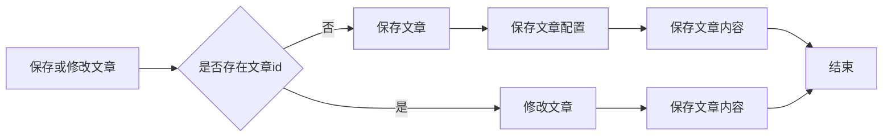
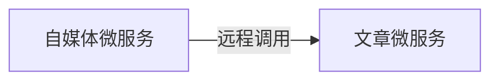

# 自媒体文章审核功能开发

主要审核文章内容，也就是文本内容和图片。

步骤如下：

1. 自媒体端发布文章，查询自媒体文章，借助第三方提供的接口审核文本内容
2. 如果审核失败将 status 设置为 2，审核结果不确定转为人工审核将 status 设置为3
3. 从 minIO中下载图片借助第三方提供的接口审核图片
4. 如果审核失败将 status 设置为 2，审核结果不确定转为人工审核将 status 设置为3
5. 审核通过，在文章微服务中创建 app 端需要的文章。返回 status 9

```java
/**
 * <p>
 * 自媒体图文内容信息表
 * </p>
 */
@Data
@TableName("wm_news")
public class WmNews implements Serializable {
    /**
     * 当前状态
     * 0 草稿
     * 1 提交（待审核）
     * 2 审核失败
     * 3 人工审核
     * 4 人工审核通过
     * 8 审核通过（待发布）
     * 9 已发布
     */
    @TableField("status")
    private Short status;

    // 状态枚举类
    @Alias("WmNewsStatus")
    public enum Status {
        NORMAL((short) 0),        // 草稿
        SUBMIT((short) 1),        // 提交 待审核
        FAIL((short) 2),          // 审核失败
        ADMIN_AUTH((short) 3),    // 人工审核
        ADMIN_SUCCESS((short) 4), // 人工审核通过
        SUCCESS((short) 8),       // 审核通过 待发布
        PUBLISHED((short) 9);     // 已发布
        short code;

        Status(short code) {
            this.code = code;
        }

        public short getCode() {
            return this.code;
        }
    }
}
```

## 内容安全第三方接口（去除）

内容安全是识别服务，支持对图片、视频、文本、语音等对象进行多样化场景检测，有效降低内容违规风险。目前很多平台都支持内容检测，如阿里云、腾讯云、百度AI、网易云等国内大型互联网公司都对外提供了API。

头条项目使用的就是阿里云的内容安全接口，使用到了图片和文本的审核。由于内容安全需要收费，所以这里将该功能去除。

## app端文章保存接口

审核通过，在文章微服务中创建 app 端需要的文章。返回 status 9

| **表名称**         | **说明**                     |
| ------------------ | ---------------------------- |
| ap_article         | 文章信息表，存储已发布的文章 |
| ap_article_config  | APP已发布文章配置表          |
| ap_article_content | APP已发布文章内容表          |

```sql
CREATE TABLE `ap_article` (
  `id` bigint unsigned NOT NULL AUTO_INCREMENT,
  `title` varchar(50) CHARACTER SET utf8mb4 COLLATE utf8mb4_unicode_ci DEFAULT NULL COMMENT '标题',
  `author_id` int unsigned DEFAULT NULL COMMENT '文章作者的ID',
  `author_name` varchar(20) CHARACTER SET utf8mb4 COLLATE utf8mb4_unicode_ci DEFAULT NULL COMMENT '作者昵称',
  `channel_id` int unsigned DEFAULT NULL COMMENT '文章所属频道ID',
  `channel_name` varchar(10) CHARACTER SET utf8mb4 COLLATE utf8mb4_unicode_ci DEFAULT NULL COMMENT '频道名称',
  `layout` tinyint unsigned DEFAULT NULL COMMENT '文章布局\r\n            0 无图文章\r\n            1 单图文章\r\n            2 多图文章',
  `flag` tinyint unsigned DEFAULT NULL COMMENT '文章标记\r\n            0 普通文章\r\n            1 热点文章\r\n            2 置顶文章\r\n            3 精品文章\r\n            4 大V 文章',
  `images` varchar(1000) CHARACTER SET utf8mb4 COLLATE utf8mb4_unicode_ci DEFAULT NULL COMMENT '文章图片\r\n            多张逗号分隔',
  `labels` varchar(500) CHARACTER SET utf8mb4 COLLATE utf8mb4_unicode_ci DEFAULT NULL COMMENT '文章标签最多3个 逗号分隔',
  `likes` int unsigned DEFAULT NULL COMMENT '点赞数量',
  `collection` int unsigned DEFAULT NULL COMMENT '收藏数量',
  `comment` int unsigned DEFAULT NULL COMMENT '评论数量',
  `views` int unsigned DEFAULT NULL COMMENT '阅读数量',
  `province_id` int unsigned DEFAULT NULL COMMENT '省市',
  `city_id` int unsigned DEFAULT NULL COMMENT '市区',
  `county_id` int unsigned DEFAULT NULL COMMENT '区县',
  `created_time` datetime DEFAULT NULL COMMENT '创建时间',
  `publish_time` datetime DEFAULT NULL COMMENT '发布时间',
  `sync_status` tinyint(1) DEFAULT '0' COMMENT '同步状态',
  `origin` tinyint unsigned DEFAULT '0' COMMENT '来源',
  `static_url` varchar(150) CHARACTER SET utf8mb4 COLLATE utf8mb4_unicode_ci DEFAULT NULL,
  PRIMARY KEY (`id`) USING BTREE
) ENGINE=InnoDB AUTO_INCREMENT=1383828014629179394 DEFAULT CHARSET=utf8mb4 COLLATE=utf8mb4_unicode_ci ROW_FORMAT=DYNAMIC COMMENT='文章信息表，存储已发布的文章'
```

```sql
CREATE TABLE `ap_article_config` (
  `id` bigint unsigned NOT NULL AUTO_INCREMENT COMMENT '主键',
  `article_id` bigint unsigned DEFAULT NULL COMMENT '文章ID',
  `is_comment` tinyint unsigned DEFAULT NULL COMMENT '是否可评论',
  `is_forward` tinyint unsigned DEFAULT NULL COMMENT '是否转发',
  `is_down` tinyint unsigned DEFAULT NULL COMMENT '是否下架',
  `is_delete` tinyint unsigned DEFAULT NULL COMMENT '是否已删除',
  PRIMARY KEY (`id`) USING BTREE,
  KEY `idx_article_id` (`article_id`) USING BTREE
) ENGINE=InnoDB AUTO_INCREMENT=1383828014645956610 DEFAULT CHARSET=utf8mb4 COLLATE=utf8mb4_unicode_ci ROW_FORMAT=DYNAMIC COMMENT='APP已发布文章配置表'
```

```sql
CREATE TABLE `ap_article_content` (
  `id` bigint unsigned NOT NULL AUTO_INCREMENT COMMENT '主键',
  `article_id` bigint unsigned DEFAULT NULL COMMENT '文章ID',
  `content` longtext CHARACTER SET utf8mb4 COLLATE utf8mb4_unicode_ci COMMENT '文章内容',
  PRIMARY KEY (`id`) USING BTREE,
  KEY `idx_article_id` (`article_id`) USING BTREE
) ENGINE=InnoDB AUTO_INCREMENT=1383828014650150915 DEFAULT CHARSET=utf8mb4 COLLATE=utf8mb4_unicode_ci ROW_FORMAT=DYNAMIC COMMENT='APP已发布文章内容表'
```

```java
package com.linxuan.model.article.pojos;

/**
 * <p>
 * 文章信息表，存储已发布的文章
 * </p>
 */
@Data
@TableName("ap_article")
public class ApArticle implements Serializable {

    @TableId(value = "id", type = IdType.ID_WORKER)
    private Long id;


    /**
     * 标题
     */
    private String title;

    /**
     * 作者id
     */
    @TableField("author_id")
    private Long authorId;

    /**
     * 作者名称
     */
    @TableField("author_name")
    private String authorName;

    /**
     * 频道id
     */
    @TableField("channel_id")
    private Integer channelId;

    /**
     * 频道名称
     */
    @TableField("channel_name")
    private String channelName;

    /**
     * 文章布局  0 无图文章   1 单图文章    2 多图文章
     */
    private Short layout;

    /**
     * 文章标记  0 普通文章   1 热点文章   2 置顶文章   3 精品文章   4 大V 文章
     */
    private Byte flag;

    /**
     * 文章封面图片 多张逗号分隔
     */
    private String images;

    /**
     * 标签
     */
    private String labels;

    /**
     * 点赞数量
     */
    private Integer likes;

    /**
     * 收藏数量
     */
    private Integer collection;

    /**
     * 评论数量
     */
    private Integer comment;

    /**
     * 阅读数量
     */
    private Integer views;

    /**
     * 省市
     */
    @TableField("province_id")
    private Integer provinceId;

    /**
     * 市区
     */
    @TableField("city_id")
    private Integer cityId;

    /**
     * 区县
     */
    @TableField("county_id")
    private Integer countyId;

    /**
     * 创建时间
     */
    @TableField("created_time")
    private Date createdTime;

    /**
     * 发布时间
     */
    @TableField("publish_time")
    private Date publishTime;

    /**
     * 同步状态
     */
    @TableField("sync_status")
    private Boolean syncStatus;

    /**
     * 来源
     */
    private Boolean origin;

    /**
     * 静态页面地址
     */
    @TableField("static_url")
    private String staticUrl;
}
```

```java
package com.linxuan.model.article.pojos;

/**
 * <p>
 * APP已发布文章配置表
 * </p>
 *
 */
@Data
@TableName("ap_article_config")
public class ApArticleConfig implements Serializable {

    @TableId(value = "id",type = IdType.ID_WORKER)
    private Long id;

    /**
     * 文章id
     */
    @TableField("article_id")
    private Long articleId;

    /**
     * 是否可评论
     * true: 可以评论   1
     * false: 不可评论  0
     */
    @TableField("is_comment")
    private Boolean isComment;

    /**
     * 是否转发
     * true: 可以转发   1
     * false: 不可转发  0
     */
    @TableField("is_forward")
    private Boolean isForward;

    /**
     * 是否下架
     * true: 下架   1
     * false: 没有下架  0
     */
    @TableField("is_down")
    private Boolean isDown;

    /**
     * 是否已删除
     * true: 删除   1
     * false: 没有删除  0
     */
    @TableField("is_delete")
    private Boolean isDelete;
}
```

```java
package com.linxuan.model.article.pojos;

@Data
@TableName("ap_article_content")
public class ApArticleContent implements Serializable {

    @TableId(value = "id",type = IdType.ID_WORKER)
    private Long id;

    /**
     * 文章id
     */
    @TableField("article_id")
    private Long articleId;

    /**
     * 文章内容
     */
    private String content;
}
```

### 分布式id策略雪花算法

随着业务的增长，文章表可能要占用很大的物理存储空间，为了解决该问题，后期使用数据库分片技术。将一个数据库进行拆分，通过数据库中间件连接。如果数据库中该表选用 ID 自增策略，则可能产生重复的 ID，此时应该使用分布式ID生成策略来生成ID。

| **方案** | **优势**                                     | **劣势**                                                     |
| -------- | -------------------------------------------- | ------------------------------------------------------------ |
| redis    | （INCR）生成一个全局连续递增  的数字类型主键 | 增加了一个外部组件的依赖，Redis不可用，则整个数据库将无法在插入 |
| UUID     | 全局唯一，Mysql也有UUID实现                  | 36个字符组成，占用空间大                                     |
| 雪花算法 | 全局唯一 ，数字类型，存储成本低              | 机器规模大于1024台无法支持                                   |

雪花算法是 Twitter 公司发明的一种算法，主要目的是解决在分布式环境下，ID 怎样生成的问题。雪花算法(SnowFlake) 是用 Scala 写的分布式 ID 算法，其生成的结果是一个 64bit 大小整数

优点：高并发分布式环境下生成不重复 id，每秒可生成百万个不重复 id。基于时间戳，以及同一时间戳下序列号自增，基本保证 id 有序递增。不依赖第三方库或者中间件。算法简单，在内存中进行，效率高。

缺点：依赖服务器时间，服务器时钟回拨时可能会生成重复 id。算法中可通过记录最后一个生成 id 时的时间戳来解决，每次生成 id 之前比较当前服务器时钟是否被回拨，避免生成重复 id。


1. 1bit，我们不会使用的，因为二进制中最高位是符号位，1表示负数，0表示正数。生成的id一般都是用整数，所以最高位固定为0。
2. 41bit-时间戳，用来记录时间戳，毫秒级。
3. 10bit-工作机器 id，用来记录工作机器 id，其中高位 5bit 是数据中心 ID 其取值范围 0-31，低位 5bit 是工作节点ID其取值范围 0-31，两个组合起来最多可以容纳 1024 个节点。
4. 序列号占用12bit，每个节点每毫秒 0 开始不断累加，最多可以累加到 4095，一共可以产生 4096 个ID。

------

在实体类中的 id 上加入如下配置，指定类型为 id_worker。之前创建的文章实体类已经标明

```java
@TableId(value = "id",type = IdType.ID_WORKER)
private Long id;
```

在 application.yml 文件中配置数据中心 id 和机器 id，这里我们是在 leadnews_article 的 Nacos 配置中心配置的。

```yaml
// TODO：没有做
mybatis-plus:
  mapper-locations: classpath*:mapper/*.xml
  # 设置别名包扫描路径，通过该属性可以给包中的类注册别名
  type-aliases-package: com.linxuan.model.article.pojos
  global-config:
    # 数据中心id(取值范围：0-31)
    datacenter-id: 1
    # 机器id(取值范围：0-31)
    workerId: 1
```

### 代码思路分析

在文章审核成功以后需要在 app 的 article 库中新增文章数据。保存文章信息 ap_article、文章配置信息 ap_article_config、文章内容 ap_article_content。

保存操作也有可能是修改操作。文章审核审核的是 wm_news 表中的数据，该表有一字段为 article_id 发布库文章ID，刚开始在自媒体端创建图文是没有值的，只有审核通过存入 ap_article 中会创建 ap_article.id，然后回传给wm_news。因此存在这种场景：创建图文 -> 审核通过 -> 回传文章ID -> 自媒体端下架文章修改 -> 重新审核 -> 有文章ID则是修改操作。



### feign远程接口实现

|          | **说明**             |
| -------- | -------------------- |
| 接口路径 | /api/v1/article/save |
| 请求方式 | POST                 |
| 参数     | ArticleDto           |
| 响应结果 | ResponseResult       |

```java
package com.linxuan.model.article.dtos;

@Data
public class ArticleDto extends ApArticle {
    /**
     * 文章内容
     */
    private String content;
}
```

```json
// 成功返回
{
    "code": 200,
    "errorMessage" : "操作成功",
    // 返回雪花算法构造的ap_article.id，用来在wm_news中对article_id 赋值
    "data":"1302864436297442242"
}

// 失败
{
    "code":501,
    "errorMessage":"参数失效",
}

{
    "code":501,
    "errorMessage":"文章没有找到",
}
```

------

```xml
<parent>
    <artifactId>linxuan-leadnews</artifactId>
    <groupId>com.linxuan</groupId>
    <version>1.0-SNAPSHOT</version>
</parent>
<modelVersion>4.0.0</modelVersion>

<artifactId>leadnews-feign-api</artifactId>

<properties>
    <maven.compiler.source>8</maven.compiler.source>
    <maven.compiler.target>8</maven.compiler.target>
</properties>

<dependencies>
    <!-- leadnews-feign-api中导入feign依赖 -->
    <dependency>
        <groupId>org.springframework.cloud</groupId>
        <artifactId>spring-cloud-starter-openfeign</artifactId>
    </dependency>
</dependencies>
```

```java
package com.linxuan.feign.api.article;

/**
 * 服务名称为leadnews-article
 */
@FeignClient("leadnews-article")
public interface IArticleClient {

    /**
     * 调用article端保存文章接口
     * @param dto
     * @return
     */
    @PostMapping("/api/v1/article/save")
    public ResponseResult saveArticle(@RequestBody ArticleDto dto);
}
```

leadnews-article 端定义接口

```java
package com.linxuan.article.feign;

@RestController
public class ArticleClient {

    /**
     * article端保存图文信息
     * @param dto
     * @return
     */
    @PostMapping("/api/v1/article/save")
    public ResponseResult saveArticle(@RequestBody ArticleDto dto) {
        return null;
    }
}
```

leadnews-article 端具体实现 saveArticle 方法

```java
package com.linxuan.model.article.pojos;

/**
 * <p>
 * APP已发布文章配置表
 * </p>
 */
@Data
@Builder
@TableName("ap_article_config")
public class ApArticleConfig implements Serializable {

    @TableId(value = "id",type = IdType.ID_WORKER)
    private Long id;

    /**
     * 文章id
     */
    @TableField("article_id")
    private Long articleId;

    /**
     * 是否可评论
     * true: 可以评论   1
     * false: 不可评论  0
     */
    @TableField("is_comment")
    private Boolean isComment;

    /**
     * 是否转发
     * true: 可以转发   1
     * false: 不可转发  0
     */
    @TableField("is_forward")
    private Boolean isForward;

    /**
     * 是否下架
     * true: 下架   1
     * false: 没有下架  0
     */
    @TableField("is_down")
    private Boolean isDown;

    /**
     * 是否已删除
     * true: 删除   1
     * false: 没有删除  0
     */
    @TableField("is_delete")
    private Boolean isDelete;
}
```

```java
package com.linxuan.article.mapper;

public interface ApArticleConfigMapper extends BaseMapper<ApArticleConfig> {
}
```

```java
package com.linxuan.article.service;

public interface ApArticleService extends IService<ApArticle> {

    /**
     * 保存app端相关文章信息
     * @param dto
     * @return
     */
    public ResponseResult saveArticle(ArticleDto dto);
}
```

```java
package com.linxuan.article.service.impl;

@Slf4j
@Service
@Transactional
public class ApArticleServiceImpl extends ServiceImpl<ApArticleMapper, ApArticle> implements ApArticleService {

    @Autowired
    private ApArticleMapper articleMapper;

    @Autowired
    private ApArticleConfigMapper apArticleConfigMapper;

    @Autowired
    private ApArticleContentMapper apArticleContentMapper;

    /**
     * 保存app端相关文章信息
     *
     * @param dto
     * @return
     */
    @Override
    public ResponseResult saveArticle(ArticleDto dto) {
        // 校验参数
        if (dto == null) {
            return ResponseResult.errorResult(AppHttpCodeEnum.PARAM_INVALID);
        }

        // 获取文章信息
        ApArticle apArticle = new ApArticle();
        BeanUtils.copyProperties(dto, apArticle);

        // 判断是否包含文章ID，不包含为新增操作，包含则为修改操作
        if (dto.getId() == null) {
            // 新增文章信息
            save(apArticle);

            // 新增文章配置
            ApArticleConfig apArticleConfig = ApArticleConfig.builder()
                    .articleId(apArticle.getId()) // 前面保存文章信息的时候会返回ID
                    .isDown(false)   // 没有下架
                    .isDelete(false) // 没有删除
                    .isComment(true) // 可以评论
                    .isForward(true) // 可以转发
                    .build();
            apArticleConfigMapper.insert(apArticleConfig);

            // 新增文章内容
            ApArticleContent apArticleContent = new ApArticleContent();
            apArticleContent.setContent(dto.getContent());
            apArticleContent.setArticleId(apArticle.getId());
            apArticleContentMapper.insert(apArticleContent);
        } else {
            // 修改文章信息
            updateById(apArticle);

            // 修改文章内容
            ApArticleContent apArticleContent = apArticleContentMapper
                .selectOne(new LambdaQueryWrapper<ApArticleContent>()
                           .eq(ApArticleContent::getArticleId, apArticle.getId()));
            apArticleContent.setContent(dto.getContent());
            apArticleContentMapper.updateById(apArticleContent);
        }

        return ResponseResult.okResult(apArticle.getId());
    }
}
```

```java
package com.linxuan.article.feign;

@RestController
public class ArticleClient {

    @Autowired
    private ApArticleService apArticleService;

    /**
     * article端保存图文信息
     * @param dto
     * @return
     */
    @PostMapping("/api/v1/article/save")
    public ResponseResult saveArticle(@RequestBody ArticleDto dto) {
        return apArticleService.saveArticle(dto);
    }
}
```

只启动 leadnews-article 项目，不启动该项目网关

```json
// 使用POST方式发送请求 http://localhost:51802/api/v1/article/save 携带如下参数
{
	"id":null,
    "title":"头条项目背景",
    "authoId":1102,
    "layout":1,
    "labels":"测试",
    "publishTime":"2028-03-14T11:35:49.000Z",
    "images": "http://192.168.88.129:9000/leadnews/2024/04/01/1286b41482d342d88844982276cbfd4c.jpg",
    "content":"头条项目背景，头条项目背景"
}
```

```json
// 返回200成功，并将文章ID成功返回
{
    "host": null,
    "code": 200,
    "errorMessage": "操作成功",
    "data": 1775706897672966146
}
```

模拟修改操作

```json
// 使用POST方式发送请求 http://localhost:51802/api/v1/article/save 携带如下参数
{
	"id":1775706897672966146,
    "title":"头条项目背景1111",
    "authoId":1102,
    "layout":1,
    "labels":"测试",
    "publishTime":"2028-03-14T11:35:49.000Z",
    "images": "http://192.168.88.129:9000/leadnews/2024/04/01/1286b41482d342d88844982276cbfd4c.jpg",
    "content":"111头条项目背景，头条项目背景"
}
```

```json
{
    "host": null,
    "code": 200,
    "errorMessage": "操作成功",
    "data": 1775706897672966146
}
```

## 文章自动审核功能（删减）

```sql
CREATE TABLE `ap_article` (
  `id` bigint unsigned NOT NULL AUTO_INCREMENT,
  `title` varchar(50) CHARACTER SET utf8mb4 COLLATE utf8mb4_unicode_ci DEFAULT NULL COMMENT '标题',
  `author_id` int unsigned DEFAULT NULL COMMENT '文章作者的ID',
  `author_name` varchar(20) CHARACTER SET utf8mb4 COLLATE utf8mb4_unicode_ci DEFAULT NULL COMMENT '作者昵称',
  `channel_id` int unsigned DEFAULT NULL COMMENT '文章所属频道ID',
  `channel_name` varchar(10) CHARACTER SET utf8mb4 COLLATE utf8mb4_unicode_ci DEFAULT NULL COMMENT '频道名称',
  `layout` tinyint unsigned DEFAULT NULL COMMENT '文章布局\r\n            0 无图文章\r\n            1 单图文章\r\n            2 多图文章',
  `flag` tinyint unsigned DEFAULT NULL COMMENT '文章标记\r\n            0 普通文章\r\n            1 热点文章\r\n            2 置顶文章\r\n            3 精品文章\r\n            4 大V 文章',
  `images` varchar(1000) CHARACTER SET utf8mb4 COLLATE utf8mb4_unicode_ci DEFAULT NULL COMMENT '文章图片\r\n            多张逗号分隔',
  `labels` varchar(500) CHARACTER SET utf8mb4 COLLATE utf8mb4_unicode_ci DEFAULT NULL COMMENT '文章标签最多3个 逗号分隔',
  `likes` int unsigned DEFAULT NULL COMMENT '点赞数量',
  `collection` int unsigned DEFAULT NULL COMMENT '收藏数量',
  `comment` int unsigned DEFAULT NULL COMMENT '评论数量',
  `views` int unsigned DEFAULT NULL COMMENT '阅读数量',
  `province_id` int unsigned DEFAULT NULL COMMENT '省市',
  `city_id` int unsigned DEFAULT NULL COMMENT '市区',
  `county_id` int unsigned DEFAULT NULL COMMENT '区县',
  `created_time` datetime DEFAULT NULL COMMENT '创建时间',
  `publish_time` datetime DEFAULT NULL COMMENT '发布时间',
  `sync_status` tinyint(1) DEFAULT '0' COMMENT '同步状态',
  `origin` tinyint unsigned DEFAULT '0' COMMENT '来源',
  `static_url` varchar(150) CHARACTER SET utf8mb4 COLLATE utf8mb4_unicode_ci DEFAULT NULL,
  PRIMARY KEY (`id`) USING BTREE
) ENGINE=InnoDB AUTO_INCREMENT=1383828014629179394 DEFAULT CHARSET=utf8mb4 COLLATE=utf8mb4_unicode_ci ROW_FORMAT=DYNAMIC COMMENT='文章信息表，存储已发布的文章'
```

```sql
CREATE TABLE `wm_news` (
  `id` int NOT NULL AUTO_INCREMENT COMMENT '主键',
  `user_id` int unsigned DEFAULT NULL COMMENT '自媒体用户ID',
  `title` varchar(36) CHARACTER SET utf8mb4 COLLATE utf8mb4_unicode_ci DEFAULT NULL COMMENT '标题',
  `content` longtext CHARACTER SET utf8mb4 COLLATE utf8mb4_unicode_ci COMMENT '图文内容',
  `type` tinyint unsigned DEFAULT NULL COMMENT '文章布局\r\n            0 无图文章\r\n            1 单图文章\r\n            3 多图文章',
  `channel_id` int unsigned DEFAULT NULL COMMENT '图文频道ID',
  `labels` varchar(20) CHARACTER SET utf8mb4 COLLATE utf8mb4_unicode_ci DEFAULT NULL,
  `created_time` datetime DEFAULT NULL COMMENT '创建时间',
  `submited_time` datetime DEFAULT NULL COMMENT '提交时间',
  `status` tinyint unsigned DEFAULT NULL COMMENT '当前状态\r\n            0 草稿\r\n            1 提交（待审核）\r\n            2 审核失败\r\n            3 人工审核\r\n            4 人工审核通过\r\n            8 审核通过（待发布）\r\n            9 已发布',
  `publish_time` datetime DEFAULT NULL COMMENT '定时发布时间，不定时则为空',
  `reason` varchar(50) CHARACTER SET utf8mb4 COLLATE utf8mb4_unicode_ci DEFAULT NULL COMMENT '拒绝理由',
  `article_id` bigint unsigned DEFAULT NULL COMMENT '发布库文章ID',
  `images` longtext CHARACTER SET utf8mb4 COLLATE utf8mb4_unicode_ci COMMENT '//图片 用逗号分隔',
  `enable` tinyint unsigned DEFAULT '1',
  PRIMARY KEY (`id`) USING BTREE
) ENGINE=InnoDB AUTO_INCREMENT=6239 DEFAULT CHARSET=utf8mb4 COLLATE=utf8mb4_unicode_ci ROW_FORMAT=DYNAMIC COMMENT='自媒体图文内容信息表'
```

```java
/**
 * <p>
 * 自媒体图文内容信息表，截取部分
 * </p>
 */
@Data
@TableName("wm_news")
public class WmNews implements Serializable {
    /**
     * 当前状态
     * 0 草稿
     * 1 提交（待审核）
     * 2 审核失败
     * 3 人工审核
     * 4 人工审核通过
     * 8 审核通过（待发布）
     * 9 已发布
     */
    @TableField("status")
    private Short status;

    // 状态枚举类
    @Alias("WmNewsStatus")
    public enum Status {
        NORMAL((short) 0),        // 草稿
        SUBMIT((short) 1),        // 提交 待审核
        FAIL((short) 2),          // 审核失败
        ADMIN_AUTH((short) 3),    // 人工审核
        ADMIN_SUCCESS((short) 4), // 人工审核通过
        SUCCESS((short) 8),       // 审核通过 待发布
        PUBLISHED((short) 9);     // 已发布
        short code;

        Status(short code) {
            this.code = code;
        }

        public short getCode() {
            return this.code;
        }
    }
}
```

### 部分代码实现

1. 根据文章ID查询自媒体文章
2. 从内容中提取纯文本内容和图片
3. 审核文本内容及图片
4. 审核成功将自媒体端wm_news中数据保存为APP端ap_article的相关文章数据，调用前面编写的feign远程接口

```java
package com.linxuan.wemedia;

/**
 * @EnableFeignClients: 开启Feign远程接口调用，这样可以注入feign接口。指定接口扫描路径
 */
@SpringBootApplication
@EnableDiscoveryClient
@MapperScan("com.linxuan.wemedia.mapper")
@EnableFeignClients(basePackages = "com.linxuan.feign.api")
public class WemediaApplication {

    public static void main(String[] args) {
        SpringApplication.run(WemediaApplication.class, args);
    }

    @Bean
    public MybatisPlusInterceptor mybatisPlusInterceptor() {
        MybatisPlusInterceptor interceptor = new MybatisPlusInterceptor();
        interceptor.addInnerInterceptor(new PaginationInnerInterceptor(DbType.MYSQL));
        return interceptor;
    }
}
```

```java
package com.linxuan.wemedia.service;

/**
 * 文章自动审核
 */
public interface WmNewsAutoScanService {

    /**
     * 自媒体文章自动审核
     *
     * @param id 自媒体文章ID
     */
    void autoScanWmNews(Integer id);
}
```

```java
package com.linxuan.wemedia.service.impl;

@Slf4j
@Service
@Transactional
public class WmNewsAutoScanServiceImpl implements WmNewsAutoScanService {

    @Autowired
    private WmNewsMapper wmNewsMapper;

    @Autowired
    private WmUserMapper wmUserMapper;

    @Autowired
    private WmChannelMapper wmChannelMapper;

    @Autowired
    private IArticleClient articleClient;

    /**
     * 自媒体文章自动审核
     *
     * @param id 自媒体文章ID
     */
    @Override
    @Transactional
    public void autoScanWmNews(Integer id) {
        // 校验参数
        if (id == null) {
            return;
        }

        // 根据文章ID查询自媒体文章
        WmNews wmNews = wmNewsMapper.selectById(id);
        if (wmNews == null) {
            throw new RuntimeException("WmNewsAutoScanServiceImpl-文章不存在");
        }

        // 从自媒体文章中提取纯文本内容、内容图片以及封面图片
        if (wmNews.getStatus().equals(WmNews.Status.SUBMIT.getCode())) {
            Map<String, Object> textAndImages = handleTextAndImages(wmNews);

            // 审核文本
            boolean isTextScan = handleTextScan((String) textAndImages.get("content"), wmNews);
            if (!isTextScan) return;

            // 审核图片
            boolean isImageScan = handleImageScan((List<String>) textAndImages.get("image"), wmNews);
            if (!isImageScan) return;

            // 审核成功，保存app端的相关的文章数据
            ResponseResult responseResult = saveAppArticle(wmNews);

            if (!responseResult.getCode().equals(200)) {
                // TODO:假设这里抛出异常 可是并不会回滚
                throw new RuntimeException("WmNewsAutoScanServiceImpl-文章审核，保存app端文章失败");
            }

            // 回填文章id
            wmNews.setArticleId((Long) responseResult.getData());
            updateWmNews(wmNews, (short) 9, "审核成功");
        }
    }


    /**
     * 从自媒体文章中提取纯文本内容、内容图片以及封面图片
     *
     * @param wmNews 自媒体文章
     * @return
     */
    public Map<String, Object> handleTextAndImages(WmNews wmNews) {

        // 存储文本内容
        StringBuilder textStringBuilder = new StringBuilder();
        // 存储图片，包括内容图片引用和封面图片引用
        List<String> imageList = new ArrayList<>();

        // 存储文章内容中的文本和图片引用
        if (StringUtils.isNotBlank(wmNews.getContent())) {
            List<Map> maps = JSON.parseArray(wmNews.getContent(), Map.class);
            for (Map map : maps) {
                if (map.get(WemediaConstants.WM_NEWS_TYPE)
                    .equals(WemediaConstants.WM_NEWS_TYPE_TEXT)) {
                    textStringBuilder.append(map.get("value"));
                }
                if (map.get(WemediaConstants.WM_NEWS_TYPE)
                    .equals(WemediaConstants.WM_NEWS_TYPE_IMAGE)) {
                    imageList.add((String) map.get("value"));
                }
            }
        }
        // 存储封面图片
        if (StringUtils.isNotBlank(wmNews.getImages())) {
            String[] coverImages = wmNews.getImages().split(",");
            imageList.addAll(Arrays.asList(coverImages));
        }

        // 返回
        Map<String, Object> map = new HashMap<>();
        map.put("content", textStringBuilder.toString());
        map.put("images", imageList);
        return map;
    }

    /**
     * 审核文本
     *
     * @param content 需要审核的文本
     * @param wmNews  标题也需要审核，审核完成之后需要修改状态、拒绝理由并存储
     * @return 直接返回true即可
     */
    public boolean handleTextScan(String content, WmNews wmNews) {
        return true;
    }

    /**
     * 审核图片
     *
     * @param images 需要审核的图片列表
     * @param wmNews 审核完成之后需要修改状态、拒绝理由并存储
     * @return 直接返回true即可
     */
    public boolean handleImageScan(List<String> images, WmNews wmNews) {
        return true;
    }

    /**
     * 在APP端存储文章信息
     *
     * @param wmNews 需要存储的自媒体端文章信息，需要转化为app端 ap_article表信息
     * @return
     */
    public ResponseResult saveAppArticle(WmNews wmNews) {
        // 最后存储的数据，接下来对数据进行封装
        ArticleDto articleDto = new ArticleDto();
        BeanUtils.copyProperties(wmNews, articleDto);

        // 设置文章ID，这个app端ap_article.id应该与自媒体端wm_news.article_id相同
        // 如果新增文章，自媒体端不会生成wm_news.article_id，而是等待app端插入数据后回填
        // 如果修改文章，这个时候要依赖于ap_article.id修改，而之前已经回填过wm_news.article_id
        if (wmNews.getArticleId() != null) {
            articleDto.setId(wmNews.getArticleId());
        }
        // 设置文章作者ID
        articleDto.setAuthorId((long) wmNews.getUserId());
        // 设置文章作者名称
        WmUser dbWmUser = wmUserMapper.selectById(wmNews.getUserId());
        if (dbWmUser != null) {
            articleDto.setAuthorName(dbWmUser.getName());
        }
        // 设置文章所属频道名称
        WmChannel dbWmChannel = wmChannelMapper.selectById(wmNews.getChannelId());
        if (dbWmChannel != null) {
            articleDto.setChannelName(dbWmChannel.getName());
        }
        // 设置文章布局
        if (wmNews.getType() != null) {
            articleDto.setLayout(wmNews.getType());
        }
        // 设置创建时间
        articleDto.setCreatedTime(new Date());

        // 返回结果
        return articleClient.saveArticle(articleDto);
    }

    /**
     * 修改自媒体端wm_news文章内容
     *
     * @param wmNews 需要更改的自媒体端文章对象
     * @param status 更改文章状态
     * @param reason 设置文章审核成功、审核失败及原因
     */
    public void updateWmNews(WmNews wmNews, short status, String reason) {
        wmNews.setStatus(status);
        wmNews.setReason(reason);
        wmNewsMapper.updateById(wmNews);
    }
}
```

因为 feign 接口调用的是 leadnews_article 的服务，所以实现需要启动 leadnews_article 项目，然后进行测试

```java
package com.linxuan.wemedia.service;

@RunWith(SpringRunner.class)
@SpringBootTest(classes = WemediaApplication.class)
public class WmNewsAutoScanServiceTest {

    @Autowired
    private WmNewsAutoScanService wmNewsAutoScanService;

    @Test
    public void autoScanWmNews() {
        wmNewsAutoScanService.autoScanWmNews(6238);
    }
}
```

### 服务降级处理



服务降级是服务自我保护的一种方式，或者保护下游服务的一种方式，用于确保服务不会受请求突增影响变得不可用，确保服务不会崩溃。服务降级虽然会导致请求失败，但是不会导致阻塞。

```java
package com.linxuan.feign.api.article.fallback;

/**
 * feign远程调用app端saveArticle失败配置
 */
@Component
public class IArticleClientFallback implements IArticleClient {
    /**
     * 调用article端保存文章接口失败配置
     *
     * @param dto
     * @return
     */
    @Override
    public ResponseResult saveArticle(ArticleDto dto) {
        return ResponseResult.errorResult(AppHttpCodeEnum.SERVER_ERROR, "获取数据失败");
    }
}
```

```java
package com.linxuan.feign.api.article;

/**
 * 服务名称为leadnews-article，失败配置类为IArticleClientFallback.class
 */
@FeignClient(value = "leadnews-article", fallback = IArticleClientFallback.class)
public interface IArticleClient {

    /**
     * 调用article端保存文章接口
     * @param dto
     * @return
     */
    @PostMapping("/api/v1/article/save")
    public ResponseResult saveArticle(@RequestBody ArticleDto dto);
}
```

```java
package com.linxuan.wemedia.config;

/**
 * 扫描降级代码类的包
 */
@Configuration
@ComponentScan("com.linxuan.feign.api.article.fallback")
public class InitConfig {
}
```

```yml
# 客户端wemedia的nacos配置中心开启服务降级
feign:
  # 开启feign对hystrix熔断降级的支持
  hystrix:
    enabled: true
  # 修改调用超时时间
  client:
    config:
      default:
        connectTimeout: 2000
        readTimeout: 2000
```

```java
package com.linxuan.article.service.impl;

@Slf4j
@Service
@Transactional
public class ApArticleServiceImpl extends ServiceImpl<ApArticleMapper, ApArticle> implements ApArticleService {

    @Autowired
    private ApArticleMapper articleMapper;

    @Autowired
    private ApArticleConfigMapper apArticleConfigMapper;

    @Autowired
    private ApArticleContentMapper apArticleContentMapper;

    /**
     * 保存app端相关文章信息
     *
     * @param dto
     * @return
     */
    @Override
    public ResponseResult saveArticle(ArticleDto dto) {

        // 测试wemedia使用feign远程接口调用article端saveArticle方法超时服务降级处理
        // TODO: 测试完成之后立马删除，否则会影响下一步进行
        try {
            Thread.sleep(3000);
        } catch (InterruptedException e) {
            e.printStackTrace();
        }

        // 校验参数
        if (dto == null) {
            return ResponseResult.errorResult(AppHttpCodeEnum.PARAM_INVALID);
        }

        // 获取文章信息
        ApArticle apArticle = new ApArticle();
        BeanUtils.copyProperties(dto, apArticle);

        // 判断是否包含文章ID，不包含为新增操作，包含则为修改操作
        if (dto.getId() == null) {
            // 新增文章信息
            save(apArticle);

            // 新增文章配置
            ApArticleConfig apArticleConfig = ApArticleConfig.builder()
                    .articleId(apArticle.getId()) // 前面保存文章信息的时候会返回ID
                    .isDown(false)   // 没有下架
                    .isDelete(false) // 没有删除
                    .isComment(true) // 可以评论
                    .isForward(true) // 可以转发
                    .build();
            apArticleConfigMapper.insert(apArticleConfig);

            // 新增文章内容
            ApArticleContent apArticleContent = new ApArticleContent();
            apArticleContent.setContent(dto.getContent());
            apArticleContent.setArticleId(apArticle.getId());
            apArticleContentMapper.insert(apArticleContent);
        } else {
            // 修改文章信息
            updateById(apArticle);

            // 修改文章内容
            ApArticleContent apArticleContent = apArticleContentMapper
                .selectOne(new LambdaQueryWrapper<ApArticleContent>()
                    .eq(ApArticleContent::getArticleId, apArticle.getId()));
            apArticleContent.setContent(dto.getContent());
            apArticleContentMapper.updateById(apArticleContent);
        }

        return ResponseResult.okResult(apArticle.getId());
    }
}
```

在自媒体端进行审核测试，会出现服务降级的现象。也就是 feign 远程调用 saveArticle 接口超时，然后 fallback。

```java
package com.linxuan.wemedia.service;

@RunWith(SpringRunner.class)
@SpringBootTest(classes = WemediaApplication.class)
public class WmNewsAutoScanServiceTest {

    @Autowired
    private WmNewsAutoScanService wmNewsAutoScanService;

    @Test
    public void autoScanWmNews() {
        wmNewsAutoScanService.autoScanWmNews(6238);
    }
}
```

## 发布文章异步调用审核

- 同步：就是在发出一个调用时，在没有得到结果之前， 该调用就不返回（实时处理）

- 异步：调用在发出之后，这个调用就直接返回了，没有返回结果（分时处理）

这里使用异步的方式调用审核功能。

### Async 注解调用

在需要异步调用的方法上添加异步注解`@Async`

```java
package com.linxuan.wemedia.service.impl;

@Slf4j
@Service
@Transactional
public class WmNewsAutoScanServiceImpl implements WmNewsAutoScanService {

    @Autowired
    private WmNewsMapper wmNewsMapper;

    @Autowired
    private WmUserMapper wmUserMapper;

    @Autowired
    private WmChannelMapper wmChannelMapper;

    @Autowired
    private IArticleClient articleClient;

    /**
     * 自媒体文章自动审核
     * Async标明该方法被异步调用，异步审核自媒体端文章
     *
     * @param id 自媒体文章ID
     */
    @Async
    @Override
    public void autoScanWmNews(Integer id) {
        // 校验参数
        if (id == null) {
            return;
        }

        // 根据文章ID查询自媒体文章
        WmNews wmNews = wmNewsMapper.selectById(id);
        if (wmNews.equals(null)) {
            throw new RuntimeException("WmNewsAutoScanServiceImpl-文章不存在");
        }

        // 从自媒体文章中提取纯文本内容、内容图片以及封面图片
        if (wmNews.getStatus().equals(WmNews.Status.SUBMIT.getCode())) {
            Map<String, Object> textAndImages = handleTextAndImages(wmNews);

            // 审核文本
            boolean isTextScan = handleTextScan((String) textAndImages.get("content"), wmNews);
            if (!isTextScan) return;

            // 审核图片
            boolean isImageScan = handleImageScan((List<String>) textAndImages.get("image"), wmNews);
            if (!isImageScan) return;

            // 审核成功，保存app端的相关的文章数据
            ResponseResult responseResult = saveAppArticle(wmNews);

            if (!responseResult.getCode().equals(200)) {
                // TODO:假设这里抛出异常 可是并不会回滚
                throw new RuntimeException("WmNewsAutoScanServiceImpl-文章审核，保存app端文章失败");
            }

            // 回填文章id
            wmNews.setArticleId((Long) responseResult.getData());
            updateWmNews(wmNews, (short) 9, "审核成功");
        }
    }
}
```

直接调用该方法即可，Spring 内部会异步调用

```java
package com.linxuan.wemedia.service.impl;

@Slf4j
@Service
@Transactional
public class WmNewsServiceImpl extends ServiceImpl<WmNewsMapper, WmNews> implements WmNewsService {

    @Autowired
    private WmMaterialMapper wmMaterialMapper;

    @Autowired
    private WmNewsMaterialMapper wmNewsMaterialMapper;

    @Autowired
    private WmNewsAutoScanService wmNewsAutoScanService;

    /**
     * 发布文章或者保存草稿
     *
     * @param dto
     * @return
     */
    @Override
    public ResponseResult submitNews(@RequestBody WmNewsDto dto) {
        // 校验参数合法性
        if (dto == null || dto.getContent() == null) {
            return ResponseResult.errorResult(AppHttpCodeEnum.PARAM_INVALID);
        }

        // 保存或修改文章
        // 设置参数保存DB
        WmNews wmNews = new WmNews();
        // 先将大部分参数由dto拷贝至wmNews对象，只有属性名称和类型相同才会拷贝
        BeanUtils.copyProperties(dto, wmNews);
        // 设置封面图片列表引用
        if (dto.getImages() != null) {
            String coverImages = StringUtils.join(dto.getImages(), ",");
            wmNews.setImages(coverImages);
        }
        // 数据库里封面图片类型type字段是unsigned无符号类型，没有-1存在，前端传过来-1将其改为null
        if (dto.getType().equals(WemediaConstants.WM_NEWS_TYPE_AUTO)) {
            wmNews.setType(null);
        }
        // 保存或修改文章
        saveOrUpdateWmNews(wmNews);

        // 判断是否为草稿，如果是草稿结束当前方法
        if (dto.getStatus().equals(WmNews.Status.NORMAL.getCode())) {
            return ResponseResult.okResult(AppHttpCodeEnum.SUCCESS);
        }

        // 不是草稿，保存图文与文章内容图片素材的关系
        // 获取到文章内容图片素材列表
        List<String> imageContentUrls = new ArrayList<>();
        List<Map> maps = JSON.parseArray(dto.getContent(), Map.class);
        for (Map map : maps) {
            if (map.get("type").equals(WemediaConstants.WM_NEWS_TYPE_IMAGE)) {
                imageContentUrls.add(map.get("value").toString());
            }
        }
        // 保存关系
        saveRelativeInfoForContent(imageContentUrls, wmNews.getId());

        // 不是草稿，保存文章封面图片与图文的关系，如果当前布局是自动，需要在内容图片引用中匹配封面图片
        saveRelativeInfoForCover(dto, wmNews, imageContentUrls);

        // ===================添加这个=====================
        // 文章异步审核
        wmNewsAutoScanService.autoScanWmNews(wmNews.getId());

        return ResponseResult.okResult(AppHttpCodeEnum.SUCCESS);
    }
}
```

引导类中使用`@EnableAsync`注解开启异步调用

```java
package com.linxuan.wemedia;

/**
 * @EnableFeignClients: 开启Feign远程接口调用，这样可以注入feign接口。指定接口扫描路径
 * @EnableTransactionManagement: 开启注解式事务驱动
 * @EnableAsync: 开启异步调用
 */
@EnableAsync
@SpringBootApplication
@EnableDiscoveryClient
@EnableTransactionManagement
@MapperScan("com.linxuan.wemedia.mapper")
@EnableFeignClients(basePackages = "com.linxuan.feign.api")
public class WemediaApplication {

    public static void main(String[] args) {
        SpringApplication.run(WemediaApplication.class, args);
    }

    @Bean
    public MybatisPlusInterceptor mybatisPlusInterceptor() {
        MybatisPlusInterceptor interceptor = new MybatisPlusInterceptor();
        interceptor.addInnerInterceptor(new PaginationInnerInterceptor(DbType.MYSQL));
        return interceptor;
    }
}
```

启动 nacos 服务端、article微服务、wemedia 微服务、wemedia 网关微服务、前端系统 wemedia 用以测试文章审核功能是否开发完毕。

自媒体前端发布一篇正常的文章，审核成功后，观察 app 端的 article 相关数据是否可以正常保存，自媒体文章状态和 app 端文章 id 是否回显。如果一切正常表示功能开发完成。

### 异步调用问题（增加）

异步调用本质就是多线程，所以可能会导致异步线程提前运行。可能出现这种情况：另一个线程没有在wemedia 中存储完毕数据，这边就开始查询了，所以可能出错。

因此想要让该异步线程正常运行，可以让其睡眠一小会。

```java
package com.linxuan.wemedia.service.impl;

@Slf4j
@Service
@Transactional
public class WmNewsAutoScanServiceImpl implements WmNewsAutoScanService {

    @Autowired
    private WmNewsMapper wmNewsMapper;

    @Autowired
    private WmUserMapper wmUserMapper;

    @Autowired
    private WmChannelMapper wmChannelMapper;

    @Autowired
    private IArticleClient articleClient;

    /**
     * 自媒体文章自动审核
     * Async标明该方法异步调用
     *
     * @param id 自媒体文章ID
     */
    @Async
    @Override
    public void autoScanWmNews(Integer id) {
        // 校验参数
        if (id == null) {
            return;
        }

        // 使用异步操作本质就是新增加一个线程，多线程运行
        // 可能该线程先运行导致自媒体端文章没有存储，因此下面根据文章ID查询自媒体端文章可能出错
        // 让该线程睡眠500毫秒=0.5秒，保证前面同步方法全部执行完毕
        try 
            TimeUnit.MILLISECONDS.sleep(500);
        } catch (InterruptedException e) {
            throw new RuntimeException(e);
        }

        // 根据文章ID查询自媒体文章
        WmNews wmNews = wmNewsMapper.selectById(id);
        if (wmNews == null) {
            throw new RuntimeException("WmNewsAutoScanServiceImpl-文章不存在");
        }

        // 从自媒体文章中提取纯文本内容、内容图片以及封面图片
        if (wmNews.getStatus().equals(WmNews.Status.SUBMIT.getCode())) {
            Map<String, Object> textAndImages = handleTextAndImages(wmNews);

            // 审核文本
            boolean isTextScan = handleTextScan((String) textAndImages.get("content"), wmNews);
            if (!isTextScan) return;

            // 审核图片
            boolean isImageScan = handleImageScan((List<String>) textAndImages.get("image"), wmNews);
            if (!isImageScan) return;

            // 审核成功，保存app端的相关的文章数据
            ResponseResult responseResult = saveAppArticle(wmNews);

            if (!responseResult.getCode().equals(200)) {
                // TODO:假设这里抛出异常 可是并不会回滚
                throw new RuntimeException("WmNewsAutoScanServiceImpl-文章审核，保存app端文章失败");
            }

            // 回填文章id
            wmNews.setArticleId((Long) responseResult.getData());
            updateWmNews(wmNews, (short) 9, "审核成功");
        }
    }
}
```

## 新需求-自管理敏感词

文章审核功能已经交付了，文章也能正常发布审核。新增如下需求，文章审核不能过滤一些敏感词：私人侦探、针孔摄象、信用卡提现、广告代理、代开发票、刻章办、出售答案、小额贷款…

也就是需要开发新的功能：需要自己维护一套敏感词，在文章审核的时候，需要验证文章是否包含这些敏感词。

| **方案**               | **说明**                     |
| ---------------------- | ---------------------------- |
| 数据库模糊查询         | 效率太低                     |
| String.indexOf("")查找 | 数据库量大的话也是比较慢     |
| 全文检索               | 分词再匹配                   |
| DFA算法                | 确定有穷自动机(一种数据结构) |

###  DFA 算法介绍

这里采用 DFA 算法来开发，DFA 全称 Deterministic Finite Automaton 确定有穷自动机。一次性的把所有的敏感词存储到了多个 map 中，就是下图表示这种结构

```json
{
    "冰": {
        "毒": {
            "isEnd": 1
        },
        "isEnd": 0
    },
    "大": {
        "麻": {
            "isEnd": 1
        },
        "isEnd": 0,
        "坏": {
            "蛋": {
                "isEnd": 1
            },
            "isEnd": 0
        }
    }
}
```

已经引入了该工具类

```java
package com.linxuan.utils.common;

public class SensitiveWordUtil {

    public static Map<String, Object> dictionaryMap = new HashMap<>();

    /**
     * 生成关键词字典库
     * @param words
     * @return
     */
    public static void initMap(Collection<String> words) {
        if (words == null) {
            System.out.println("敏感词列表不能为空");
            return ;
        }

        // map初始长度words.size()，整个字典库的入口字数(小于words.size()，因为不同的词可能会有相同的首字)
        Map<String, Object> map = new HashMap<>(words.size());
        // 遍历过程中当前层次的数据
        Map<String, Object> curMap = null;
        Iterator<String> iterator = words.iterator();

        while (iterator.hasNext()) {
            String word = iterator.next();
            curMap = map;
            int len = word.length();
            for (int i =0; i < len; i++) {
                // 遍历每个词的字
                String key = String.valueOf(word.charAt(i));
                // 当前字在当前层是否存在, 不存在则新建, 当前层数据指向下一个节点, 继续判断是否存在数据
                Map<String, Object> wordMap = (Map<String, Object>) curMap.get(key);
                if (wordMap == null) {
                    // 每个节点存在两个数据: 下一个节点和isEnd(是否结束标志)
                    wordMap = new HashMap<>(2);
                    wordMap.put("isEnd", "0");
                    curMap.put(key, wordMap);
                }
                curMap = wordMap;
                // 如果当前字是词的最后一个字，则将isEnd标志置1
                if (i == len -1) {
                    curMap.put("isEnd", "1");
                }
            }
        }

        dictionaryMap = map;
    }

    /**
     * 搜索文本中某个文字是否匹配关键词
     * @param text
     * @param beginIndex
     * @return
     */
    private static int checkWord(String text, int beginIndex) {
        if (dictionaryMap == null) {
            throw new RuntimeException("字典不能为空");
        }
        boolean isEnd = false;
        int wordLength = 0;
        Map<String, Object> curMap = dictionaryMap;
        int len = text.length();
        // 从文本的第beginIndex开始匹配
        for (int i = beginIndex; i < len; i++) {
            String key = String.valueOf(text.charAt(i));
            // 获取当前key的下一个节点
            curMap = (Map<String, Object>) curMap.get(key);
            if (curMap == null) {
                break;
            } else {
                wordLength ++;
                if ("1".equals(curMap.get("isEnd"))) {
                    isEnd = true;
                }
            }
        }
        if (!isEnd) {
            wordLength = 0;
        }
        return wordLength;
    }

    /**
     * 获取匹配的关键词和命中次数
     * @param text
     * @return
     */
    public static Map<String, Integer> matchWords(String text) {
        Map<String, Integer> wordMap = new HashMap<>();
        int len = text.length();
        for (int i = 0; i < len; i++) {
            int wordLength = checkWord(text, i);
            if (wordLength > 0) {
                String word = text.substring(i, i + wordLength);
                // 添加关键词匹配次数
                if (wordMap.containsKey(word)) {
                    wordMap.put(word, wordMap.get(word) + 1);
                } else {
                    wordMap.put(word, 1);
                }

                i += wordLength - 1;
            }
        }
        return wordMap;
    }

    public static void main(String[] args) {
        List<String> list = new ArrayList<>();
        list.add("法轮");
        list.add("法轮功");
        list.add("冰毒");
        initMap(list);
        String content="我是一个好人，并不会卖冰毒，也不操练法轮功,我真的不卖冰毒";
        Map<String, Integer> map = matchWords(content);
        System.out.println(map);
    }
}
```

### 集成文章审核

导入中 wm_sensitive 到 leadnews_wemedia 库中

```sql
CREATE DATABASE IF NOT EXISTS leadnews_wemedia DEFAULT CHARACTER SET utf8mb4 COLLATE utf8mb4_unicode_ci;
USE leadnews_wemedia;
SET NAMES utf8;

SET FOREIGN_KEY_CHECKS=0;

-- ----------------------------
-- Table structure for wm_sensitive
-- ----------------------------
DROP TABLE IF EXISTS `wm_sensitive`;
CREATE TABLE `wm_sensitive` (
  `id` int(11) unsigned NOT NULL AUTO_INCREMENT COMMENT '主键',
  `sensitives` varchar(10) COLLATE utf8mb4_unicode_ci DEFAULT NULL COMMENT '敏感词',
  `created_time` datetime DEFAULT NULL COMMENT '创建时间',
  PRIMARY KEY (`id`) USING BTREE
) ENGINE=InnoDB AUTO_INCREMENT=3201 DEFAULT CHARSET=utf8mb4 COLLATE=utf8mb4_unicode_ci ROW_FORMAT=DYNAMIC COMMENT='敏感词信息表';

-- ----------------------------
-- Records of wm_sensitive
-- ----------------------------
INSERT INTO `wm_sensitive` VALUES ('3104', '冰毒', '2021-05-23 15:38:51');
INSERT INTO `wm_sensitive` VALUES ('3105', '法轮功', '2021-05-23 15:38:51');
INSERT INTO `wm_sensitive` VALUES ('3106', '私人侦探', '2021-05-23 11:09:22');
INSERT INTO `wm_sensitive` VALUES ('3107', '针孔摄象', '2021-05-23 11:09:52');
INSERT INTO `wm_sensitive` VALUES ('3108', '信用卡提现', '2021-05-23 11:10:11');
INSERT INTO `wm_sensitive` VALUES ('3109', '无抵押贷款', '2021-05-23 11:10:41');
INSERT INTO `wm_sensitive` VALUES ('3110', '广告代理', '2021-05-23 11:10:59');
INSERT INTO `wm_sensitive` VALUES ('3111', '代开发票', '2021-05-23 11:11:18');
INSERT INTO `wm_sensitive` VALUES ('3112', '蚁力神', '2021-05-23 11:11:39');
INSERT INTO `wm_sensitive` VALUES ('3113', '售肾', '2021-05-23 11:12:08');
INSERT INTO `wm_sensitive` VALUES ('3114', '刻章办', '2021-05-23 11:12:24');
INSERT INTO `wm_sensitive` VALUES ('3116', '套牌车', '2021-05-23 11:12:37');
INSERT INTO `wm_sensitive` VALUES ('3117', '足球投注', '2021-05-23 11:12:51');
INSERT INTO `wm_sensitive` VALUES ('3118', '地下钱庄', '2021-05-23 11:13:07');
INSERT INTO `wm_sensitive` VALUES ('3119', '出售答案', '2021-05-23 11:13:24');
INSERT INTO `wm_sensitive` VALUES ('3200', '小额贷款', '2021-05-23 11:13:40');
```

```java
package com.linxuan.model.wemedia.pojos;

/**
 * <p>
 * 敏感词信息表
 * </p>
 */
@Data
@TableName("wm_sensitive")
public class WmSensitive implements Serializable {

    private static final long serialVersionUID = 1L;

    /**
     * 主键
     */
    @TableId(value = "id", type = IdType.AUTO)
    private Integer id;

    /**
     * 敏感词
     */
    @TableField("sensitives")
    private String sensitives;

    /**
     * 创建时间
     */
    @TableField("created_time")
    private Date createdTime;
}
```

```java
package com.linxuan.wemedia.mapper;

public interface WmSensitiveMapper extends BaseMapper<WmSensitive> {
}
```

```java
package com.linxuan.wemedia.service.impl;

@Slf4j
@Service
@Transactional
public class WmNewsAutoScanServiceImpl implements WmNewsAutoScanService {

    @Autowired
    private WmNewsMapper wmNewsMapper;

    @Autowired
    private WmUserMapper wmUserMapper;

    @Autowired
    private WmChannelMapper wmChannelMapper;

    @Autowired
    private IArticleClient articleClient;

    @Autowired
    private WmSensitiveMapper wmSensitiveMapper;

    /**
     * 自媒体文章自动审核
     * Async标明该方法异步调用
     *
     * @param id 自媒体文章ID
     */
    @Async
    @Override
    public void autoScanWmNews(Integer id) {
        // 校验参数
        if (id == null) {
            return;
        }

        // 使用异步操作本质就是新增加一个线程，多线程运行
        // 可能该线程先运行导致自媒体端文章没有存储，因此下面根据文章ID查询自媒体端文章可能出错
        // 让该线程睡眠500毫秒=0.5秒，保证前面同步方法全部执行完毕
        try 
            TimeUnit.MILLISECONDS.sleep(500);
    } catch (InterruptedException e) {
        throw new RuntimeException(e);
    }

    // 根据文章ID查询自媒体文章
    WmNews wmNews = wmNewsMapper.selectById(id);
    if (wmNews == null) {
        throw new RuntimeException("WmNewsAutoScanServiceImpl-文章不存在");
    }

    // 从自媒体文章中提取纯文本内容、内容图片以及封面图片
    if (wmNews.getStatus().equals(WmNews.Status.SUBMIT.getCode())) {
        Map<String, Object> textAndImages = handleTextAndImages(wmNews);

        // ================添加该代码并创建handleTextSensitiveScan方法==========================
        // 首先通过自己维护的敏感词管理系统来审核文本
        boolean isTextSensitiveScan = handleTextSensitiveScan((String) textAndImages.get("content"), wmNews);
        if (!isTextSensitiveScan) return;

        // 审核文本
        boolean isTextScan = handleTextScan((String) textAndImages.get("content"), wmNews);
        if (!isTextScan) return;

        // 审核图片
        boolean isImageScan = handleImageScan((List<String>) textAndImages.get("image"), wmNews);
        if (!isImageScan) return;

        // 审核成功，保存app端的相关的文章数据
        ResponseResult responseResult = saveAppArticle(wmNews);

        if (!responseResult.getCode().equals(200)) {
            // TODO:假设这里抛出异常 可是并不会回滚
            throw new RuntimeException("WmNewsAutoScanServiceImpl-文章审核，保存app端文章失败");
        }

        // 回填文章id
        wmNews.setArticleId((Long) responseResult.getData());
        updateWmNews(wmNews, (short) 9, "审核成功");
    }
    
    
    /**
     * 通过自己管理的敏感词系统审核文本
     *
     * @param content 需要审核的文本
     * @param wmNews  标题也需要审核，审核完成之后需要修改状态、拒绝理由并存储
     * @return
     */
    private boolean handleTextSensitiveScan(String content, WmNews wmNews) {

        // 设置标记
        boolean flag = true;

        // 获取DB中存储的敏感词列表，只取敏感词字段数据
        List<WmSensitive> wmSensitives = wmSensitiveMapper
            .selectList(new LambdaQueryWrapper<WmSensitive>().select(WmSensitive::getSensitives));
        // 将泛型转为String类型
        List<String> sensitiveList = wmSensitives.stream()
            .map(WmSensitive::getSensitives).collect(Collectors.toList());

        // 初始化敏感词字典，生成关键词字典库
        SensitiveWordUtil.initMap(sensitiveList);
        // 审核
        Map<String, Integer> result = SensitiveWordUtil.matchWords(wmNews.getTitle() + content);
        if (!result.isEmpty()) {
            updateWmNews(wmNews, (short) 2, "存在违规信息: " + result);
            flag = false;
        }
        return flag;
    }
}
```

启动 nacos 服务端、article微服务、wemedia 微服务、wemedia 网关微服务、前端系统 wemedia 用以测试子管理敏感词审核功能是否开发完毕。

发布一篇文章，携带敏感词词汇，例如「冰毒、私家侦探」，最后会发现审核不通过。


## 8)新需求-图片识别文字审核敏感词

#### 8.1)需求分析

产品经理召集开会，文章审核功能已经交付了，文章也能正常发布审核。对于上次提出的自管理敏感词也很满意，这次会议核心的内容如下：

- 文章中包含的图片要识别文字，过滤掉图片文字的敏感词


#### 8.2)图片文字识别

什么是OCR?

OCR （Optical Character Recognition，光学字符识别）是指电子设备（例如扫描仪或数码相机）检查纸上打印的字符，通过检测暗、亮的模式确定其形状，然后用字符识别方法将形状翻译成计算机文字的过程

| **方案**      | **说明**                                            |
| ------------- | --------------------------------------------------- |
| 百度OCR       | 收费                                                |
| Tesseract-OCR | Google维护的开源OCR引擎，支持Java，Python等语言调用 |
| Tess4J        | 封装了Tesseract-OCR  ，支持Java调用                 |

#### 8.3)Tess4j案例

①：创建项目导入tess4j对应的依赖

```xml
<dependency>
    <groupId>net.sourceforge.tess4j</groupId>
    <artifactId>tess4j</artifactId>
    <version>4.1.1</version>
</dependency>
```

②：导入中文字体库， 把资料中的tessdata文件夹拷贝到自己的工作空间下


③：编写测试类进行测试

```java
package com.heima.tess4j;

import net.sourceforge.tess4j.ITesseract;
import net.sourceforge.tess4j.Tesseract;

import java.io.File;

public class Application {

    public static void main(String[] args) {
        try {
            //获取本地图片
            File file = new File("D:\\26.png");
            //创建Tesseract对象
            ITesseract tesseract = new Tesseract();
            //设置字体库路径
            tesseract.setDatapath("D:\\workspace\\tessdata");
            //中文识别
            tesseract.setLanguage("chi_sim");
            //执行ocr识别
            String result = tesseract.doOCR(file);
            //替换回车和tal键  使结果为一行
            result = result.replaceAll("\\r|\\n","-").replaceAll(" ","");
            System.out.println("识别的结果为："+result);
        } catch (Exception e) {
            e.printStackTrace();
        }
    }
}
```

#### 8.4)管理敏感词和图片文字识别集成到文章审核

①：在heima-leadnews-common中创建工具类，简单封装一下tess4j

需要先导入pom

```xml
<dependency>
    <groupId>net.sourceforge.tess4j</groupId>
    <artifactId>tess4j</artifactId>
    <version>4.1.1</version>
</dependency>
```

工具类

```java
package com.heima.common.tess4j;

import lombok.Getter;
import lombok.Setter;
import net.sourceforge.tess4j.ITesseract;
import net.sourceforge.tess4j.Tesseract;
import net.sourceforge.tess4j.TesseractException;
import org.springframework.boot.context.properties.ConfigurationProperties;
import org.springframework.stereotype.Component;

import java.awt.image.BufferedImage;

@Getter
@Setter
@Component
@ConfigurationProperties(prefix = "tess4j")
public class Tess4jClient {

    private String dataPath;
    private String language;

    public String doOCR(BufferedImage image) throws TesseractException {
        //创建Tesseract对象
        ITesseract tesseract = new Tesseract();
        //设置字体库路径
        tesseract.setDatapath(dataPath);
        //中文识别
        tesseract.setLanguage(language);
        //执行ocr识别
        String result = tesseract.doOCR(image);
        //替换回车和tal键  使结果为一行
        result = result.replaceAll("\\r|\\n", "-").replaceAll(" ", "");
        return result;
    }

}
```

在spring.factories配置中添加该类,完整如下：

```java
org.springframework.boot.autoconfigure.EnableAutoConfiguration=\
  com.heima.common.exception.ExceptionCatch,\
  com.heima.common.swagger.SwaggerConfiguration,\
  com.heima.common.swagger.Swagger2Configuration,\
  com.heima.common.aliyun.GreenTextScan,\
  com.heima.common.aliyun.GreenImageScan,\
  com.heima.common.tess4j.Tess4jClient
```

②：在heima-leadnews-wemedia中的配置中添加两个属性

```yaml
tess4j:
  data-path: D:\workspace\tessdata
  language: chi_sim
```

③：在WmNewsAutoScanServiceImpl中的handleImageScan方法上添加如下代码

```java
try {
    for (String image : images) {
        byte[] bytes = fileStorageService.downLoadFile(image);

        //图片识别文字审核---begin-----

        //从byte[]转换为butteredImage
        ByteArrayInputStream in = new ByteArrayInputStream(bytes);
        BufferedImage imageFile = ImageIO.read(in);
        //识别图片的文字
        String result = tess4jClient.doOCR(imageFile);

        //审核是否包含自管理的敏感词
        boolean isSensitive = handleSensitiveScan(result, wmNews);
        if(!isSensitive){
            return isSensitive;
        }

        //图片识别文字审核---end-----


        imageList.add(bytes);

    } 
}catch (Exception e){
    e.printStackTrace();
}
```


最后附上文章审核的完整代码如下：

```java
package com.heima.wemedia.service.impl;

import com.alibaba.fastjson.JSONArray;
import com.baomidou.mybatisplus.core.toolkit.Wrappers;
import com.heima.apis.article.IArticleClient;
import com.heima.common.aliyun.GreenImageScan;
import com.heima.common.aliyun.GreenTextScan;
import com.heima.common.tess4j.Tess4jClient;
import com.heima.file.service.FileStorageService;
import com.heima.model.article.dtos.ArticleDto;
import com.heima.model.common.dtos.ResponseResult;
import com.heima.model.wemedia.pojos.WmChannel;
import com.heima.model.wemedia.pojos.WmNews;
import com.heima.model.wemedia.pojos.WmSensitive;
import com.heima.model.wemedia.pojos.WmUser;
import com.heima.utils.common.SensitiveWordUtil;
import com.heima.wemedia.mapper.WmChannelMapper;
import com.heima.wemedia.mapper.WmNewsMapper;
import com.heima.wemedia.mapper.WmSensitiveMapper;
import com.heima.wemedia.mapper.WmUserMapper;
import com.heima.wemedia.service.WmNewsAutoScanService;
import lombok.extern.slf4j.Slf4j;
import org.apache.commons.lang3.StringUtils;
import org.springframework.beans.BeanUtils;
import org.springframework.beans.factory.annotation.Autowired;
import org.springframework.scheduling.annotation.Async;
import org.springframework.stereotype.Service;
import org.springframework.transaction.annotation.Transactional;

import javax.imageio.ImageIO;
import java.awt.image.BufferedImage;
import java.io.ByteArrayInputStream;
import java.util.*;
import java.util.stream.Collectors;


@Service
@Slf4j
@Transactional
public class WmNewsAutoScanServiceImpl implements WmNewsAutoScanService {

    @Autowired
    private WmNewsMapper wmNewsMapper;

    /**
     * 自媒体文章审核
     *
     * @param id 自媒体文章id
     */
    @Override
    @Async  //标明当前方法是一个异步方法
    public void autoScanWmNews(Integer id) {

//        int a = 1/0;

        //1.查询自媒体文章
        WmNews wmNews = wmNewsMapper.selectById(id);
        if (wmNews == null) {
            throw new RuntimeException("WmNewsAutoScanServiceImpl-文章不存在");
        }

        if (wmNews.getStatus().equals(WmNews.Status.SUBMIT.getCode())) {
            //从内容中提取纯文本内容和图片
            Map<String, Object> textAndImages = handleTextAndImages(wmNews);

            //自管理的敏感词过滤
            boolean isSensitive = handleSensitiveScan((String) textAndImages.get("content"), wmNews);
            if(!isSensitive) return;

            //2.审核文本内容  阿里云接口
            boolean isTextScan = handleTextScan((String) textAndImages.get("content"), wmNews);
            if (!isTextScan) return;

            //3.审核图片  阿里云接口
            boolean isImageScan = handleImageScan((List<String>) textAndImages.get("images"), wmNews);
            if (!isImageScan) return;

            //4.审核成功，保存app端的相关的文章数据
            ResponseResult responseResult = saveAppArticle(wmNews);
            if (!responseResult.getCode().equals(200)) {
                throw new RuntimeException("WmNewsAutoScanServiceImpl-文章审核，保存app端相关文章数据失败");
            }
            //回填article_id
            wmNews.setArticleId((Long) responseResult.getData());
            updateWmNews(wmNews, (short) 9, "审核成功");

        }
    }

    @Autowired
    private WmSensitiveMapper wmSensitiveMapper;

    /**
     * 自管理的敏感词审核
     * @param content
     * @param wmNews
     * @return
     */
    private boolean handleSensitiveScan(String content, WmNews wmNews) {

        boolean flag = true;

        //获取所有的敏感词
        List<WmSensitive> wmSensitives = wmSensitiveMapper.selectList(Wrappers.<WmSensitive>lambdaQuery().select(WmSensitive::getSensitives));
        List<String> sensitiveList = wmSensitives.stream().map(WmSensitive::getSensitives).collect(Collectors.toList());

        //初始化敏感词库
        SensitiveWordUtil.initMap(sensitiveList);

        //查看文章中是否包含敏感词
        Map<String, Integer> map = SensitiveWordUtil.matchWords(content);
        if(map.size() >0){
            updateWmNews(wmNews,(short) 2,"当前文章中存在违规内容"+map);
            flag = false;
        }

        return flag;
    }

    @Autowired
    private IArticleClient articleClient;

    @Autowired
    private WmChannelMapper wmChannelMapper;

    @Autowired
    private WmUserMapper wmUserMapper;

    /**
     * 保存app端相关的文章数据
     *
     * @param wmNews
     */
    private ResponseResult saveAppArticle(WmNews wmNews) {

        ArticleDto dto = new ArticleDto();
        //属性的拷贝
        BeanUtils.copyProperties(wmNews, dto);
        //文章的布局
        dto.setLayout(wmNews.getType());
        //频道
        WmChannel wmChannel = wmChannelMapper.selectById(wmNews.getChannelId());
        if (wmChannel != null) {
            dto.setChannelName(wmChannel.getName());
        }

        //作者
        dto.setAuthorId(wmNews.getUserId().longValue());
        WmUser wmUser = wmUserMapper.selectById(wmNews.getUserId());
        if (wmUser != null) {
            dto.setAuthorName(wmUser.getName());
        }

        //设置文章id
        if (wmNews.getArticleId() != null) {
            dto.setId(wmNews.getArticleId());
        }
        dto.setCreatedTime(new Date());

        ResponseResult responseResult = articleClient.saveArticle(dto);
        return responseResult;

    }


    @Autowired
    private FileStorageService fileStorageService;

    @Autowired
    private GreenImageScan greenImageScan;

    @Autowired
    private Tess4jClient tess4jClient;

    /**
     * 审核图片
     *
     * @param images
     * @param wmNews
     * @return
     */
    private boolean handleImageScan(List<String> images, WmNews wmNews) {

        boolean flag = true;

        if (images == null || images.size() == 0) {
            return flag;
        }

        //下载图片 minIO
        //图片去重
        images = images.stream().distinct().collect(Collectors.toList());

        List<byte[]> imageList = new ArrayList<>();

        try {
            for (String image : images) {
                byte[] bytes = fileStorageService.downLoadFile(image);

                //图片识别文字审核---begin-----

                //从byte[]转换为butteredImage
                ByteArrayInputStream in = new ByteArrayInputStream(bytes);
                BufferedImage imageFile = ImageIO.read(in);
                //识别图片的文字
                String result = tess4jClient.doOCR(imageFile);

                //审核是否包含自管理的敏感词
                boolean isSensitive = handleSensitiveScan(result, wmNews);
                if(!isSensitive){
                    return isSensitive;
                }

                //图片识别文字审核---end-----


                imageList.add(bytes);

            }
        }catch (Exception e){
            e.printStackTrace();
        }


        //审核图片
        try {
            Map map = greenImageScan.imageScan(imageList);
            if (map != null) {
                //审核失败
                if (map.get("suggestion").equals("block")) {
                    flag = false;
                    updateWmNews(wmNews, (short) 2, "当前文章中存在违规内容");
                }

                //不确定信息  需要人工审核
                if (map.get("suggestion").equals("review")) {
                    flag = false;
                    updateWmNews(wmNews, (short) 3, "当前文章中存在不确定内容");
                }
            }

        } catch (Exception e) {
            flag = false;
            e.printStackTrace();
        }
        return flag;
    }

    @Autowired
    private GreenTextScan greenTextScan;

    /**
     * 审核纯文本内容
     *
     * @param content
     * @param wmNews
     * @return
     */
    private boolean handleTextScan(String content, WmNews wmNews) {

        boolean flag = true;

        if ((wmNews.getTitle() + "-" + content).length() == 0) {
            return flag;
        }
        try {
            Map map = greenTextScan.greeTextScan((wmNews.getTitle() + "-" + content));
            if (map != null) {
                //审核失败
                if (map.get("suggestion").equals("block")) {
                    flag = false;
                    updateWmNews(wmNews, (short) 2, "当前文章中存在违规内容");
                }

                //不确定信息  需要人工审核
                if (map.get("suggestion").equals("review")) {
                    flag = false;
                    updateWmNews(wmNews, (short) 3, "当前文章中存在不确定内容");
                }
            }
        } catch (Exception e) {
            flag = false;
            e.printStackTrace();
        }

        return flag;

    }

    /**
     * 修改文章内容
     *
     * @param wmNews
     * @param status
     * @param reason
     */
    private void updateWmNews(WmNews wmNews, short status, String reason) {
        wmNews.setStatus(status);
        wmNews.setReason(reason);
        wmNewsMapper.updateById(wmNews);
    }

    /**
     * 1。从自媒体文章的内容中提取文本和图片
     * 2.提取文章的封面图片
     *
     * @param wmNews
     * @return
     */
    private Map<String, Object> handleTextAndImages(WmNews wmNews) {

        //存储纯文本内容
        StringBuilder stringBuilder = new StringBuilder();

        List<String> images = new ArrayList<>();

        //1。从自媒体文章的内容中提取文本和图片
        if (StringUtils.isNotBlank(wmNews.getContent())) {
            List<Map> maps = JSONArray.parseArray(wmNews.getContent(), Map.class);
            for (Map map : maps) {
                if (map.get("type").equals("text")) {
                    stringBuilder.append(map.get("value"));
                }

                if (map.get("type").equals("image")) {
                    images.add((String) map.get("value"));
                }
            }
        }
        //2.提取文章的封面图片
        if (StringUtils.isNotBlank(wmNews.getImages())) {
            String[] split = wmNews.getImages().split(",");
            images.addAll(Arrays.asList(split));
        }

        Map<String, Object> resultMap = new HashMap<>();
        resultMap.put("content", stringBuilder.toString());
        resultMap.put("images", images);
        return resultMap;

    }
}
```

## 9)文章详情-静态文件生成

#### **9.1)思路分析**

文章端创建app相关文章时，生成文章详情静态页上传到MinIO中


#### 9.2)实现步骤

1.新建ArticleFreemarkerService创建静态文件并上传到minIO中

```java
package com.heima.article.service;

import com.heima.model.article.pojos.ApArticle;

public interface ArticleFreemarkerService {

    /**
     * 生成静态文件上传到minIO中
     * @param apArticle
     * @param content
     */
    public void buildArticleToMinIO(ApArticle apArticle,String content);
}
```

实现

```java
package com.heima.article.service.impl;

import com.alibaba.fastjson.JSON;
import com.alibaba.fastjson.JSONArray;
import com.baomidou.mybatisplus.core.toolkit.Wrappers;
import com.heima.article.mapper.ApArticleContentMapper;
import com.heima.article.service.ApArticleService;
import com.heima.article.service.ArticleFreemarkerService;
import com.heima.file.service.FileStorageService;
import com.heima.model.article.pojos.ApArticle;
import freemarker.template.Configuration;
import freemarker.template.Template;
import lombok.extern.slf4j.Slf4j;
import org.apache.commons.lang3.StringUtils;
import org.springframework.beans.BeanUtils;
import org.springframework.beans.factory.annotation.Autowired;
import org.springframework.scheduling.annotation.Async;
import org.springframework.stereotype.Service;
import org.springframework.transaction.annotation.Transactional;

import java.io.ByteArrayInputStream;
import java.io.InputStream;
import java.io.StringWriter;
import java.util.HashMap;
import java.util.Map;

@Service
@Slf4j
@Transactional
public class ArticleFreemarkerServiceImpl implements ArticleFreemarkerService {

    @Autowired
    private ApArticleContentMapper apArticleContentMapper;

    @Autowired
    private Configuration configuration;

    @Autowired
    private FileStorageService fileStorageService;

    @Autowired
    private ApArticleService apArticleService;

    /**
     * 生成静态文件上传到minIO中
     * @param apArticle
     * @param content
     */
    @Async
    @Override
    public void buildArticleToMinIO(ApArticle apArticle, String content) {
        //已知文章的id
        //4.1 获取文章内容
        if(StringUtils.isNotBlank(content)){
            //4.2 文章内容通过freemarker生成html文件
            Template template = null;
            StringWriter out = new StringWriter();
            try {
                template = configuration.getTemplate("article.ftl");
                //数据模型
                Map<String,Object> contentDataModel = new HashMap<>();
                contentDataModel.put("content", JSONArray.parseArray(content));
                //合成
                template.process(contentDataModel,out);
            } catch (Exception e) {
                e.printStackTrace();
            }

            //4.3 把html文件上传到minio中
            InputStream in = new ByteArrayInputStream(out.toString().getBytes());
            String path = fileStorageService.uploadHtmlFile("", apArticle.getId() + ".html", in);


            //4.4 修改ap_article表，保存static_url字段
            apArticleService.update(Wrappers.<ApArticle>lambdaUpdate().eq(ApArticle::getId,apArticle.getId())
                    .set(ApArticle::getStaticUrl,path));


        }
    }

}
```

2.在ApArticleService的saveArticle实现方法中添加调用生成文件的方法

```java
/**
     * 保存app端相关文章
     * @param dto
     * @return
     */
@Override
public ResponseResult saveArticle(ArticleDto dto) {

    //        try {
    //            Thread.sleep(3000);
    //        } catch (InterruptedException e) {
    //            e.printStackTrace();
    //        }
    //1.检查参数
    if(dto == null){
        return ResponseResult.errorResult(AppHttpCodeEnum.PARAM_INVALID);
    }

    ApArticle apArticle = new ApArticle();
    BeanUtils.copyProperties(dto,apArticle);

    //2.判断是否存在id
    if(dto.getId() == null){
        //2.1 不存在id  保存  文章  文章配置  文章内容

        //保存文章
        save(apArticle);

        //保存配置
        ApArticleConfig apArticleConfig = new ApArticleConfig(apArticle.getId());
        apArticleConfigMapper.insert(apArticleConfig);

        //保存 文章内容
        ApArticleContent apArticleContent = new ApArticleContent();
        apArticleContent.setArticleId(apArticle.getId());
        apArticleContent.setContent(dto.getContent());
        apArticleContentMapper.insert(apArticleContent);

    }else {
        //2.2 存在id   修改  文章  文章内容

        //修改  文章
        updateById(apArticle);

        //修改文章内容
        ApArticleContent apArticleContent = apArticleContentMapper.selectOne(Wrappers.<ApArticleContent>lambdaQuery().eq(ApArticleContent::getArticleId, dto.getId()));
        apArticleContent.setContent(dto.getContent());
        apArticleContentMapper.updateById(apArticleContent);
    }

    //异步调用 生成静态文件上传到minio中
    articleFreemarkerService.buildArticleToMinIO(apArticle,dto.getContent());


    //3.结果返回  文章的id
    return ResponseResult.okResult(apArticle.getId());
}
```

3.文章微服务开启异步调用


