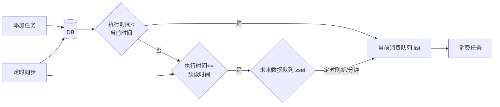
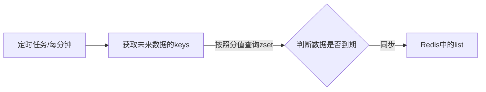
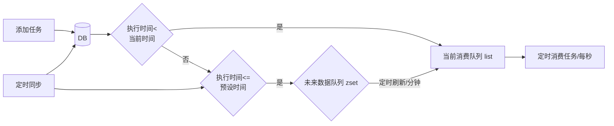
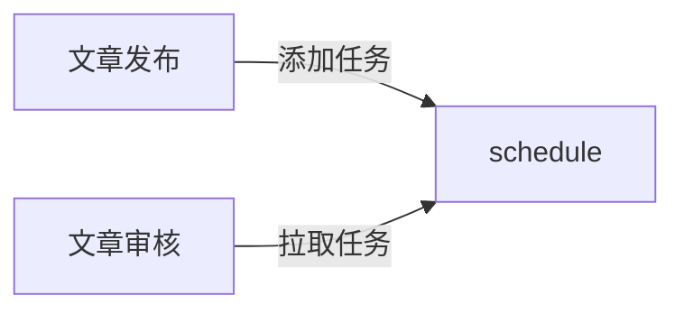

# 延迟任务精准发布文章

## 延迟任务介绍

- 定时任务：有固定周期的，有明确的触发时间
- 延迟队列：没有固定的开始时间，它常常是由一个事件触发的，而在这个事件触发之后的一段时间内触发另一个事件，任务可以立即执行，也可以延迟

延迟任务应用场景：

1. 场景一：订单下单之后30分钟后，如果用户没有付钱，则系统自动取消订单；如果期间下单成功，任务取消

2. 场景二：接口对接出现网络问题，1分钟后重试，如果失败，2分钟重试，直到出现阈值终止


## 延迟任务技术

一共有三种方法：DelayQueue（给予JVM）、RabbitMQ（TTL+死信队列）、Redis（zset 特性）。

**DelayQueue**

JDK自带 DelayQueue 是一个支持延时获取元素的阻塞队列， 内部采用优先队列 PriorityQueue 存储元素，同时元素必须实现 Delayed 接口；在创建元素时可以指定多久才可以从队列中获取当前元素，只有在延迟期满时才能从队列中提取元素

DelayQueue 属于排序队列，它的特殊之处在于队列的元素必须实现 Delayed 接口，该接口需要实现 compareTo 和getDelay 方法。

- getDelay方法：获取元素在队列中的剩余时间，只有当剩余时间为0时元素才可以出队列。

- compareTo方法：用于排序，确定元素出队列的顺序。


使用线程池或者原生 DelayQueue 任务都是放在内存，程序挂掉之后，需要考虑未处理消息的丢失带来的影响。所以需要保证数据不丢失，也就是让数据进行持久化存储，存储进磁盘。

**RabbitMQ实现延迟任务**

- TTL：Time To Live (消息存活时间)

- 死信队列：Dead Letter Exchange(死信交换机)，当消息成为Dead message后，可以重新发送另一个交换机（死信交换机）

**redis实现**

zset数据类型的去重有序（分数排序）特点进行延迟。例如：时间戳作为score进行排序

## redis实现延迟任务思路



延迟任务首先需要存储在 DB 中，这是因为延迟任务是一个通用的服务，任何需要延迟得任务都可以调用该服务，需要考虑数据持久化的问题，存储数据库中是一种数据安全的考虑。如果直接存储在 Redis 中数据量过大。

Redis 中使用两种数据类型 list 和 zset 的原因：list 存储立即执行的任务，zset 存储未来的数据；任务量过大之后zset 性能会下降。list.push 的时间复杂度是O(1)、zset 的时间复杂度是O(M*log(n))。

使用 zset 添加数据的时候，需要判断任务执行时间是否小于预设时间（一般是当前时间 + 5分钟），而不是将所有延迟任务直接放到 zset 中。同样是防止数据量过大。任务模块是一个通用的模块，项目中任何需要延迟队列的地方，都可以调用这个接口，要考虑到数据量的问题，如果数据量特别大，为了防止阻塞，只需要把未来几分钟要执行的数据存入缓存即可。

```sh
# Docker安装redis
# 拉取redis镜像
[root@localhost ~]# docker pull redis
Using default tag: latest
latest: Pulling from library/redis
Digest: sha256:db485f2e245b5b3329fdc7eff4eb00f913e09d8feb9ca720788059fdc2ed8339
Status: Downloaded newer image for redis:latest
docker.io/library/redis:latest
# 查看当前镜像
[root@localhost ~]# docker images
REPOSITORY           TAG       IMAGE ID       CREATED       SIZE
redis                latest    7614ae9453d1   2 years ago   113MB
minio/minio          latest    ff82d4160c26   3 years ago   183MB
nacos/nacos-server   1.2.0     763941e566bb   3 years ago   732MB
# 创建容器，设置redis密码为leadnews
[root@localhost ~]# docker run -d --name redis --restart=always -p 6379:6379 redis --requirepass "leadnews"
a3e85f73b2d245a735c194a81aedcb76d2a0264ed1f17a0583d5c460110f592e
```

使用本地的 Redis Desktop Manager 连接虚拟机 Docker 中的Redis，输入host、port、auth（密码）连接测试

### 搭建leadnews-schedule模块

leadnews-schedule 是一个通用的服务，单独创建模块来管理任何类型的延迟任务。在 leadnews-service 模块下面创建 leadnews-schedule模块。

```xml
<?xml version="1.0" encoding="UTF-8"?>
<project xmlns="http://maven.apache.org/POM/4.0.0"
         xmlns:xsi="http://www.w3.org/2001/XMLSchema-instance"
         xsi:schemaLocation="http://maven.apache.org/POM/4.0.0 http://maven.apache.org/xsd/maven-4.0.0.xsd">
    <modelVersion>4.0.0</modelVersion>
    <parent>
        <groupId>com.linxuan</groupId>
        <artifactId>leadnews-service</artifactId>
        <version>1.0-SNAPSHOT</version>
    </parent>

    <artifactId>leadnews-schedule</artifactId>

    <properties>
        <maven.compiler.source>8</maven.compiler.source>
        <maven.compiler.target>8</maven.compiler.target>
        <project.build.sourceEncoding>UTF-8</project.build.sourceEncoding>
    </properties>

</project>
```

```java
package com.linxuan.schedule;

@SpringBootApplication
@MapperScan("com.linxuan.schedule.mapper")
public class ScheduleApplication {
    public static void main(String[] args) {
        SpringApplication.run(ScheduleApplication.class, args);
    }
}
```

```yml
# leadnews-schedule模块的bootstrap.yml配置
server:
  port: 51701
spring:
  application:
    name: leadnews-schedule
  cloud:
    nacos:
      discovery:
        server-addr: 192.168.88.129:8848
      config:
        server-addr: 192.168.88.129:8848
        file-extension: yml
```

```yml
# leadnews-schedule模块的nacos配置, Data ID:leadnews-schedule
spring:
  datasource:
    driver-class-name: com.mysql.jdbc.Driver
    url: jdbc:mysql://localhost:3306/leadnews_schedule?useUnicode=true&characterEncoding=UTF-8&serverTimezone=UTC&useSSL=false
    username: root
    password: root
# 设置Mapper接口所对应的XML文件位置，如果你在Mapper接口中有自定义方法，需要进行该配置
mybatis-plus:
  # mapper映射文件路径设置
  mapper-locations: classpath*:mapper/*.xml
  # 设置别名包扫描路径，通过该属性可以给包中的类注册别名
  type-aliases-package: com.linxuan.model.schedule.pojos
```

### 数据库准备

| 类型       | 大小                  | 描述                             |
| ---------- | --------------------- | -------------------------------- |
| CHAR       | 0-255 bytes           | 定长字符串                       |
| VARCHAR    | 0-65535 bytes         | 变长字符串                       |
| TINYBLOB   | 0-255 bytes           | 不超过255个字符的二进制数据      |
| TINYTEXT   | 0-255 bytes           | 短文本字符串                     |
| BLOB       | 0-65 535 bytes        | 二进制形式的长文本数据           |
| TEXT       | 0-65 535 bytes        | 长文本数据                       |
| MEDIUMBLOB | 0-16 777 215 bytes    | 二进制形式的中等长度文本数据     |
| MEDIUMTEXT | 0-16 777 215 bytes    | 中等长度文本数据                 |
| LONGBLOB   | 0-4 294 967 295 bytes | 二进制形式的极大文本数据，最大4G |
| LONGTEXT   | 0-4 294 967 295 bytes | 极大文本数据                     |

```sql
CREATE DATABASE IF NOT EXISTS leadnews_schedule DEFAULT CHARACTER SET utf8mb4 COLLATE utf8mb4_unicode_ci;
USE leadnews_wemedia;

SET FOREIGN_KEY_CHECKS=0;

-- ----------------------------
-- Table structure for taskinfo parameters采用的是longblob类型，最大4G数据
-- ----------------------------
DROP TABLE IF EXISTS `taskinfo`;
CREATE TABLE `taskinfo` (
  `task_id` bigint(20) NOT NULL COMMENT '任务id',
  `execute_time` datetime(3) NOT NULL COMMENT '执行时间',
  `parameters` longblob COMMENT '参数',
  `priority` int(11) NOT NULL COMMENT '优先级',
  `task_type` int(11) NOT NULL COMMENT '任务类型',
  PRIMARY KEY (`task_id`),
  KEY `index_taskinfo_time` (`task_type`,`priority`,`execute_time`)
) ENGINE=InnoDB DEFAULT CHARSET=utf8 COMMENT="任务表";

-- ----------------------------
-- Table structure for taskinfo_logs
-- ----------------------------
DROP TABLE IF EXISTS `taskinfo_logs`;
CREATE TABLE `taskinfo_logs` (
  `task_id` bigint(20) NOT NULL COMMENT '任务id',
  `execute_time` datetime(3) NOT NULL COMMENT '执行时间',
  `parameters` longblob COMMENT '参数',
  `priority` int(11) NOT NULL COMMENT '优先级',
  `task_type` int(11) NOT NULL COMMENT '任务类型',
  `version` int(11) NOT NULL COMMENT '版本号,用乐观锁',
  `status` int(11) DEFAULT '0' COMMENT '状态 0=初始化状态 1=EXECUTED 2=CANCELLED',
  PRIMARY KEY (`task_id`)
) ENGINE=InnoDB DEFAULT CHARSET=utf8 COMMENT="任务日志表";
```

```java
package com.linxuan.model.schedule.pojos;

@Data
@TableName("taskinfo")
public class Taskinfo implements Serializable {

    private static final long serialVersionUID = 1L;

    /**
     * 任务id
     */
    @TableId(type = IdType.ID_WORKER)
    private Long taskId;

    /**
     * 执行时间
     */
    @TableField("execute_time")
    private Date executeTime;

    /**
     * 参数
     */
    @TableField("parameters")
    private byte[] parameters;

    /**
     * 优先级
     */
    @TableField("priority")
    private Integer priority;

    /**
     * 任务类型, Schedule模块可以被不同的项目调用，可以处理不同类型的延迟任务
     */
    @TableField("task_type")
    private Integer taskType;
}
```

```java
package com.linxuan.model.schedule.pojos;

@Data
@TableName("taskinfo_logs")
public class TaskinfoLogs implements Serializable {

    private static final long serialVersionUID = 1L;

    /**
     * 任务id
     */
    @TableId(type = IdType.ID_WORKER)
    private Long taskId;

    /**
     * 执行时间
     */
    @TableField("execute_time")
    private Date executeTime;

    /**
     * 参数
     */
    @TableField("parameters")
    private byte[] parameters;

    /**
     * 优先级
     */
    @TableField("priority")
    private Integer priority;

    /**
     * 任务类型, Schedule模块可以被不同的项目调用，可以处理不同类型的延迟任务
     */
    @TableField("task_type")
    private Integer taskType;

    /**
     * 版本号,用乐观锁
     */
    @Version
    private Integer version;

    /**
     * 状态 0=SCHEDULED初始化 1=EXECUTED已执行 2=CANCELLED已取消
     */
    @TableField("status")
    private Integer status;
}
```

在 leadnews-schedule 中开启乐观锁支持：

```java
package com.linxuan.schedule;

@SpringBootApplication
@MapperScan("com.linxuan.schedule.mapper")
public class ScheduleApplication {
    public static void main(String[] args) {
        SpringApplication.run(ScheduleApplication.class, args);
    }

    /**
     * mybatis-plus乐观锁支持。项目中使用MP乐观锁第一步在属性上添加@Version，第二步注入Bean
     *
     * @return
     */
    @Bean
    public MybatisPlusInterceptor optimisticLockerInterceptor() {
        MybatisPlusInterceptor interceptor = new MybatisPlusInterceptor();
        interceptor.addInnerInterceptor(new OptimisticLockerInnerInterceptor());
        return interceptor;
    }
}
```

### 项目集成redis

```xml
<!-- 在leadnews-common模块的pom.xml文件导入Redis依赖，之后在该模块下创建CacheService类供其他模块调用 -->
<name>leadnews-common</name>
<dependencies>
    <!-- 导入redis依赖 -->
    <dependency>
        <groupId>org.springframework.boot</groupId>
        <artifactId>spring-boot-starter-data-redis</artifactId>
    </dependency>
    <!-- redis依赖commons-pool 这个依赖一定要添加 -->
    <dependency>
        <groupId>org.apache.commons</groupId>
        <artifactId>commons-pool2</artifactId>
    </dependency>
</dependencies>
```

将 CacheService 类复制到 leadnews-common 模块的 com/linxuan/common/redis 目录下，文件太大，放弃复制。

```sh
# 在leadnews-common模块下的spring.factories文件添加自动配置CacheService
org.springframework.boot.autoconfigure.EnableAutoConfiguration=\
  com.linxuan.common.exception.ExceptionCatch,\
  com.linxuan.common.swagger.SwaggerConfiguration,\
  com.linxuan.common.tess4j.Tess4jClient,\
  com.linxuan.common.redis.CacheService
```

因为是 leadnews-schedule 调用 CacheService 从而调用 Redis 服务，所以在 leadnews-schedule 端添加 Redis 相关配置。

```yaml
spring:
  # 在leadnews-schedule中集成redis,添加以下nacos配置
  redis:
    host: 192.168.88.129
    password: leadnews
    port: 6379
  datasource:
    driver-class-name: com.mysql.jdbc.Driver
    url: jdbc:mysql://localhost:3306/leadnews_schedule?useUnicode=true&characterEncoding=UTF-8&serverTimezone=UTC&useSSL=false
    username: root
    password: root
# 设置Mapper接口所对应的XML文件位置，如果你在Mapper接口中有自定义方法，需要进行该配置
mybatis-plus:
  # mapper映射文件路径设置
  mapper-locations: classpath*:mapper/*.xml
  # 设置别名包扫描路径，通过该属性可以给包中的类注册别名
  type-aliases-package: com.linxuan.model.schedule.pojos
```

测试

```java
package com.linxuan.schedule.test;

@RunWith(SpringRunner.class)
@SpringBootTest(classes = ScheduleApplication.class)
public class RedisTest {

    @Autowired
    private CacheService cacheService;

    @Test
    public void testList() {
        // 在list的左边添加元素
        cacheService.lLeftPush("list_001", "hello,redis");

        // 在list的右边获取元素，并删除
        System.out.println(cacheService.lRightPop("list_001"));
    }

    @Test
    public void testZset() {
        // 添加数据到zset中  分值
        cacheService.zAdd("zset_key_001","hello zset 001",1000);
        cacheService.zAdd("zset_key_001","hello zset 002",8888);
        cacheService.zAdd("zset_key_001","hello zset 003",7777);
        cacheService.zAdd("zset_key_001","hello zset 004",999999);

        // 按照分值获取数据
        Set<String> zset_key_001 = cacheService.zRangeByScore("zset_key_001", 0, 8888);
        System.out.println(zset_key_001);
    }
}
```

#### 添加任务

创建 mapper 文件

```java
package com.linxuan.schedule.mapper;

public interface TaskinfoMapper extends BaseMapper<Taskinfo> {

    /**
     * 查询任务
     *
     * @param type     类型
     * @param priority 优先级
     * @param future   时间
     * @return
     */
    List<Taskinfo> queryFutureTime(@Param("taskType") int type,
                                   @Param("priority") int priority,
                                   @Param("future") Date future);
}
```

```java
package com.linxuan.schedule.mapper;

public interface TaskinfoLogsMapper extends BaseMapper<TaskinfoLogs> {
}
```

```xml
<?xml version="1.0" encoding="UTF-8"?>
<!-- resouces/mapper下创建TaskinfoMapper.xml映射文件 -->
<!DOCTYPE mapper PUBLIC "-//mybatis.org//DTD Mapper 3.0//EN" "http://mybatis.org/dtd/mybatis-3-mapper.dtd">
<mapper namespace="com.linxuan.schedule.mapper.TaskinfoMapper">

    <select id="queryFutureTime" resultType="com.linxuan.model.schedule.pojos.Taskinfo">
        select *
        from taskinfo
        where task_type = #{taskType}
          and priority = #{priority}
          and execute_time <![CDATA[<]]> #{future,javaType=java.util.Date}
    </select>

</mapper>
```

创建 Task 类，用于接收添加任务的参数

```java
package com.linxuan.model.schedule.dtos;

@Data
public class Task implements Serializable {

    /**
     * 任务id
     */
    private Long taskId;
    
    /**
     * 任务类型, Schedule模块可以被不同的项目调用，可以处理不同类型的延迟任务
     */
    private Integer taskType;

    /**
     * 优先级
     */
    private Integer priority;

    /**
     * 执行id
     */
    private long executeTime;

    /**
     * task参数
     */
    private byte[] parameters;
}
```

leadnews-common 模块下面创建常量类 ScheduleConstants

```java
package com.linxuan.common.constants;

public class ScheduleConstants {

    // task状态
    // 初始化状态
    public static final int SCHEDULED = 0;
    // 已执行状态
    public static final int EXECUTED = 1;
    // 已取消状态
    public static final int CANCELLED = 2;

    // 未来数据key前缀，存储在zset中
    public static String FUTURE = "future_";
    // 当前数据key前缀，存储在list中
    public static String TOPIC = "topic_";
}
```

业务层开发

```java
package com.linxuan.schedule.service;

public interface TaskService {

    /**
     * 添加任务
     *
     * @param task 任务对象
     * @return 任务id
     */
    long addTask(Task task);
}
```

```java
package com.linxuan.schedule.service.impl;

@Slf4j
@Service
@Transactional
public class TaskServiceImpl implements TaskService {

    @Autowired
    private TaskinfoMapper taskinfoMapper;

    @Autowired
    private TaskinfoLogsMapper taskinfoLogsMapper;

    @Autowired
    private CacheService cacheService;

    /**
     * 添加任务
     *
     * @param task 任务对象
     * @return 任务id
     */
    @Override
    public long addTask(Task task) {
        // 校验参数
        if (task == null)
            return 0;

        // 添加任务到DB中
        if (addTaskToDB(task)) {
            // 添加任务到Redis中
            addTaskToCache(task);
        }

        // 返回任务ID
        return task.getTaskId();
    }


    /**
     * 添加任务到DB
     *
     * @param task 任务
     * @return true添加成功 false添加失败
     */
    private boolean addTaskToDB(Task task) {

        boolean flag = false;
        try {
            // 创建Taskinfo存储对象
            Taskinfo taskinfo = new Taskinfo();
            BeanUtils.copyProperties(task, taskinfo);
            // Task类中执行时间executeTime类型为long、TaskInfo类中执行时间executeTime类型为Date
            taskinfo.setExecuteTime(new Date(task.getExecuteTime()));
            // 存储
            taskinfoMapper.insert(taskinfo);

            // Task是地址引用，设置它的taskId 最后返回
            task.setTaskId(taskinfo.getTaskId());

            // 创建TaskinfoLogs存储对象
            TaskinfoLogs taskinfoLogs = new TaskinfoLogs();
            BeanUtils.copyProperties(taskinfo, taskinfoLogs);
            taskinfoLogs.setVersion(1);
            taskinfoLogs.setStatus(ScheduleConstants.SCHEDULED);
            taskinfoLogsMapper.insert(taskinfoLogs);

            flag = true;
        } catch (Exception e) {
            e.printStackTrace();
        }
        return flag;
    }

    /**
     * 任务添加到Redis中
     *
     * @param task 需要添加的任务
     */
    private void addTaskToCache(Task task) {
        // 根据任务类型和任务优先级组成Reids中存储的键
        String key = getCacheKey(task.getTaskType(), task.getPriority());

        // 获取当前时间 + 5分钟
        Calendar calendar = Calendar.getInstance();
        calendar.add(Calendar.MINUTE, 5);
        long nextScheduleTime = calendar.getTimeInMillis();

        // 如果任务执行的时间小于当前时间 存储list
        if (task.getExecuteTime() < System.currentTimeMillis()) {
            cacheService.lLeftPush(ScheduleConstants.TOPIC + key, JSON.toJSONString(task));
        } else if (task.getExecuteTime() <= nextScheduleTime) {
            // 任务执行时间小于预设时间(当前时间 + 5分钟) 存储zset 键、值、分数
            cacheService.zAdd(ScheduleConstants.FUTURE + key,
                              JSON.toJSONString(task), task.getExecuteTime());
        }
    }

    /**
     * 根据taskType和priority组成Redis中存储的key
     *
     * @param taskType 任务类型
     * @param priority 任务优先级
     * @return 返回key
     */
    private String getCacheKey(int taskType, int priority) {
        if (taskType == null || priority == null) {
            throw new RuntimeException("Redis中存储键异常");
        }
        return taskType + "_" + priority;
    }
}
```

创建测试类测试

```java
package com.linxuan.schedule.service.impl;

@RunWith(SpringRunner.class)
@SpringBootTest(classes = ScheduleApplication.class)
public class TaskServiceImplTest {

    @Autowired
    private TaskService taskService;

    @Test
    public void addTask() {
        Task task = new Task();
        task.setTaskType(100);
        task.setPriority(50);
        task.setParameters("task test".getBytes());
        task.setExecuteTime(new Date().getTime());

        // 调用添加任务方法并打印任务ID
        System.out.println(taskService.addTask(task));
    }
}
```

#### 取消任务

有这么一种场景：第三接口网络不同，使用延迟任务重试，达到阈值以后，取消任务。

```java
package com.linxuan.schedule.service;

public interface TaskService {

    /**
     * 添加任务
     *
     * @param task 任务对象
     * @return 任务id
     */
    long addTask(Task task);

    /**
     * 取消任务
     * @param taskId 需要取消的任务的ID
     * @return true取消成功、false取消失败
     */
    boolean cancelTask(long taskId);
}
```

```java
package com.linxuan.schedule.service.impl;

@Slf4j
@Service
@Transactional
public class TaskServiceImpl implements TaskService {

    @Autowired
    private TaskinfoMapper taskinfoMapper;

    @Autowired
    private TaskinfoLogsMapper taskinfoLogsMapper;

    @Autowired
    private CacheService cacheService;

    /**
     * 取消任务
     *
     * @param taskId 需要取消的任务的ID
     * @return true取消成功、false取消失败
     */
    @Override
    public boolean cancelTask(long taskId) {
        // 删除任务 更新日志状态为2=CANCELLED已取消；
        // 消费任务也是删除任务 更新日志状态 只不过将日志状态更改为1=EXECUTED已执行
        Task task = updateDb(taskId, ScheduleConstants.CANCELLED);

        if (task != null) {
            // 删除Redis中存储的任务
            removeTaskFromCache(task);
            return true;
        }
        return false;
    }

    /**
     * 根据taskType和priority组成Redis中存储的key
     *
     * @param taskType 任务类型
     * @param priority 任务优先级
     * @return 返回key
     */
    private String getCacheKey(int taskType, int priority) {
        if (taskType == null || priority == null) {
            throw new RuntimeException("Redis中存储键异常");
        }
        return taskType + "_" + priority;
    }

    /**
     * 取消任务 更新日志中任务的状态
     *
     * @param taskId 需要取消的任务
     * @param status 更改为该状态
     * @return 返回Task用以找寻Redis中存储的该任务
     */
    private Task updateDb(long taskId, int status) {
        Task task = null;
        try {
            // DB中taskinfo表删除该任务
            int result = taskinfoMapper.deleteById(taskId);
            if (result == 0) {
                throw new RuntimeException("删除任务失败");
            }

            // taskinfo_logs更新任务状态
            TaskinfoLogs taskinfoLogs = taskinfoLogsMapper.selectById(taskId);
            taskinfoLogs.setStatus(status);
            taskinfoLogsMapper.updateById(taskinfoLogs);

            // 构建返回的Task对象
            task = new Task();
            BeanUtils.copyProperties(taskinfoLogs, task);
            task.setExecuteTime(taskinfoLogs.getExecuteTime().getTime());
        } catch (Exception e) {
            log.error("task cancel exception taskid={}", taskId);
        }

        return task;
    }

    /**
     * 移除Redis中存储的任务Task
     *
     * @param task 通过taskType+priority确定键、executeTime确定从list还是zset中删除
     */
    private void removeTaskFromCache(Task task) {
        // 获取Redis中存储该Task的key
        String key = getCacheKey(task.getTaskType(), task.getPriority());

        if (task.getExecuteTime() <= System.currentTimeMillis()) {
            // 0是删除所有和 JSON.toJSONString(task) 匹配的数据
            cacheService.lRemove(ScheduleConstants.TOPIC + key, 0, JSON.toJSONString(task));
        } else {
            cacheService.zRemove(ScheduleConstants.FUTURE + key, JSON.toJSONString(task));
        }
    }
}
```

测试

```java
package com.linxuan.schedule.service.impl;

@RunWith(SpringRunner.class)
@SpringBootTest(classes = ScheduleApplication.class)
public class TaskServiceImplTest {

    @Autowired
    private TaskService taskService;

    @Test
    public void cancelTaskTest() {
        System.out.println(taskService.cancelTask(1776840007500185601L));
    }
}
```

#### 消费任务

```java
package com.linxuan.schedule.service;

public interface TaskService {

    /**
     * 按照类型和优先级来拉取任务消费
     *
     * @param type     任务类型
     * @param priority 任务优先级
     * @return 返回任务Task对象
     */
    Task pollTask(int type, int priority);
}
```

```java
package com.linxuan.schedule.service.impl;

@Slf4j
@Service
@Transactional
public class TaskServiceImpl implements TaskService {

    @Autowired
    private TaskinfoMapper taskinfoMapper;

    @Autowired
    private TaskinfoLogsMapper taskinfoLogsMapper;

    @Autowired
    private CacheService cacheService;

    /**
     * 按照类型和优先级来拉取任务消费
     *
     * @param type     任务类型
     * @param priority 任务优先级
     * @return 返回任务Task对象
     */
    @Override
    public Task pollTask(int type, int priority) {
        Task task = null;
        try {
            // 获取Redis中存储数据的key
            String key = getCacheKey(type, priority);
            // 从list里面获取要消费的任务
            String taskJson = cacheService.lRightPop(ScheduleConstants.TOPIC + key);
            if (StringUtils.isNotBlank(taskJson)) {
                task = JSON.parseObject(taskJson, Task.class);
                // 修改DB该Task状态 taskinfo删除该Task taskinfo_logs修改状态为已消费
                updateDb(task.getTaskId(), ScheduleConstants.EXECUTED);
            }
        } catch (Exception e) {
            e.printStackTrace();
            log.error("poll task exception");
        }

        return task;
    }

    /**
     * 根据taskType和priority组成Redis中存储的key
     *
     * @param taskType 任务类型
     * @param priority 任务优先级
     * @return 返回key
     */
    private String getCacheKey(Integer taskType, Integer priority) {
        if (taskType == null || priority == null) {
            throw new RuntimeException("Redis中存储键异常");
        }
        return taskType + "_" + priority;
    }
}
```

```java
package com.linxuan.schedule.service.impl;

@RunWith(SpringRunner.class)
@SpringBootTest(classes = ScheduleApplication.class)
public class TaskServiceImplTest {

    @Autowired
    private TaskService taskService;

    // 先确保Redis中存在数据
    @Test
    public void addTask() {
        Task task = new Task();
        task.setTaskType(100);
        task.setPriority(50);
        task.setParameters("task test".getBytes());
        task.setExecuteTime(new Date().getTime());

        System.out.println(taskService.addTask(task));
    }

    // 测试消费任务
    @Test
    public void pollTest() {
        System.out.println(taskService.pollTask(100, 50));
    }
}
```

#### 未来数据zset定时刷新至list



首先需要获取未来数据 zset 中存储的所有 key。有两种方法：

1. keys 模糊匹配。keys 的模糊匹配功能很方便也很强大，但是在生产环境需要慎用！开发中使用 keys 的模糊匹配会发现 redis 的 CPU 使用率极高，所以 redis 生产环境将 keys 命令禁用！redis是单线程，会被堵塞

   ```java
   @Test
   public void testKeys() {
       // 使用keys方式模糊匹配所有的前缀为future_的所有key 生产环境不要使用
       Set<String> keys = cacheService.keys("future_*");
       System.out.println(keys);
   }
   ```

2. scan 命令。SCAN 命令是一个基于游标的迭代器，SCAN 命令每次被调用之后， 都会向用户返回一个新的游标， 用户在下次迭代时需要使用这个新游标作为 SCAN 命令的游标参数， 以此来延续之前的迭代过程。

   ```java
   @Test
   public void testKeys() {
       // 使用scan方式模糊匹配所有的前缀为future_的所有key
       Set<String> scan = cacheService.scan("future_*");
       System.out.println(scan);
   }
   ```

将未来数据从 zset 刷新至 list 中

```java
package com.linxuan.schedule.service.impl;

@Slf4j
@Service
@Transactional
public class TaskServiceImpl implements TaskService {

    /**
     * Redis中存储的未来数据从zset定时刷新至list中, 每分钟刷新一次
     *
     * @Scheduled: 定时任务。引导类中添加开启任务调度注解：@EnableScheduling
     */
    @Scheduled(cron = "0 */1 * * * ?")
    public void refreshTaskToList() {
        // 获取zset中存储的所有未来5分钟内要执行的任务数据集合的key值
        Set<String> futureKeys = cacheService.scan(ScheduleConstants.FUTURE + "*");
        for (String futureKey : futureKeys) {
            // 获取该组key对应的需要消费的任务数据
            Set<String> tasks = cacheService.zRangeByScore(futureKey, 0, System.currentTimeMillis());
            if (!tasks.isEmpty()) {
                // 设置当前任务数据放到list中后的key
                String topicKey = ScheduleConstants.TOPIC + 
                    futureKey.split(ScheduleConstants.FUTURE)[1];
                // 将任务数据添加到消费者队列list中 使用Redis管道技术(效率更高)
                cacheService.refreshWithPipeline(futureKey, topicKey, tasks);
                System.out.println("将" + futureKey + "下当前需要执行任务数据刷新到" + topicKey);
            }
        }
    }
}
```

```java
// 添加任务到zset中
@Test
public void addTask() {
    for (int i = 0; i < 5; i++) {
        Task task = new Task();
        task.setTaskType(100 + i);
        task.setPriority(50);
        task.setParameters("task test".getBytes());
        // 设置执行时间为当前时间+500 * i，保证任务放到zset中
        task.setExecuteTime(new Date().getTime() + 500 * i);
        taskService.addTask(task);
    }
}

```

```java
package com.linxuan.schedule;

/**
 * @EnableScheduling: 开启调度任务
 */
@EnableScheduling
@SpringBootApplication
@MapperScan("com.linxuan.schedule.mapper")
public class ScheduleApplication {
    public static void main(String[] args) {
        SpringApplication.run(ScheduleApplication.class, args);
    }

    /**
     * mybatis-plus乐观锁支持
     *
     * @return
     */
    @Bean
    public MybatisPlusInterceptor optimisticLockerInterceptor() {
        MybatisPlusInterceptor interceptor = new MybatisPlusInterceptor();
        interceptor.addInnerInterceptor(new OptimisticLockerInnerInterceptor());
        return interceptor;
    }
}
```

添加完任务到 zset 中之后启动整个项目，每分钟会将 zset 中的任务刷新至 list 中。

## 集群下的方法抢占执行

启动两台 leadnews-schedule 服务，每台服务都会去执行 refresh 定时任务方法，这样肯定是有问题的，我们只需要一个项目取刷新定时任务即可。这个时候就用到了分布式锁的解决方法。

分布式锁：控制分布式系统有序的去对共享资源进行操作，通过互斥来保证数据的一致性。

| 方案      | 说明                                |
| --------- | ----------------------------------- |
| 数据库    | 基于表的唯一索引                    |
| zookeeper | 根据 zookeeper 中的临时有序节点排序 |
| redis     | 使用 SETNX 命令完成                 |

### redis分布式锁

sexnx （SET if Not eXists） 命令在指定的 key 不存在时，为 key 设置指定的值。

这种加锁的思路是，如果 key 不存在则为 key 设置 value，如果 key 已存在则 SETNX 命令不做任何操作

- 客户端 A 请求服务器设置 key 的值，如果设置成功就表示加锁成功
- 客户端 B 也去请求服务器设置 key 的值，如果返回失败，那么就代表加锁失败
- 客户端 A 执行代码完成，删除锁
- 客户端 B 在等待一段时间后再去请求设置 key 的值，设置成功
- 客户端 B 执行代码完成，删除锁

### 项目集成解决

CacheService 中添加如下方法

```java
package com.linxuan.common.redis;

@Component
public class CacheService extends CachingConfigurerSupport {
    @Autowired
    private StringRedisTemplate stringRedisTemplate;
    
    /**
     * 加锁
     *
     * @param name
     * @param expire
     * @return
     */
    public String tryLock(String name, long expire) {
        name = name + "_lock";
        String token = UUID.randomUUID().toString();
        RedisConnectionFactory factory = stringRedisTemplate.getConnectionFactory();
        RedisConnection conn = factory.getConnection();
        try {

            // 参考redis命令：
            // set key value [EX seconds] [PX milliseconds] [NX|XX]
            Boolean result = conn.set(
                name.getBytes(),
                token.getBytes(),
                Expiration.from(expire, TimeUnit.MILLISECONDS),
                RedisStringCommands.SetOption.SET_IF_ABSENT // NX
            );
            if (result != null && result)
                return token;
        } finally {
            RedisConnectionUtils.releaseConnection(conn, factory, false);
        }
        return null;
    }
}
```

```java
package com.linxuan.common.constants;

public class ScheduleConstants {

    // task状态
    // 初始化状态
    public static final int SCHEDULED = 0;
    // 已执行状态
    public static final int EXECUTED = 1;
    // 已取消状态
    public static final int CANCELLED = 2;

    // 未来数据key前缀，存储在zset中
    public static String FUTURE = "future_";
    // 当前数据key前缀，存储在list中
    public static String TOPIC = "topic_";

    // 任务锁
    public static String FUTURE_TASK_SYNC = "FUTURE_TASK_SYNC";
}
```

修改未来数据定时刷新的方法，如下：

```java
package com.linxuan.schedule.service.impl;

@Slf4j
@Service
@Transactional
public class TaskServiceImpl implements TaskService {
    
    /**
     * Redis中存储的未来数据从zset定时刷新至list中, 每分钟刷新一次
     *
     * @Scheduled: 定时任务。引导类中添加开启任务调度注解：@EnableScheduling
     */
    @Scheduled(cron = "0 */1 * * * ?")
    public void refreshTaskToList() {
        // 加锁
        String token = cacheService.tryLock(ScheduleConstants.FUTURE_TASK_SYNC, 1000 * 30);
        if (StringUtils.isNotBlank(token)) {
            // 获取zset中存储的所有未来5分钟内要执行的任务数据集合的key值
            Set<String> futureKeys = cacheService.scan(ScheduleConstants.FUTURE + "*");
            for (String futureKey : futureKeys) {
                // 获取该组key对应的需要消费的任务数据
                Set<String> tasks = cacheService.zRangeByScore(futureKey, 0, 
                                                               System.currentTimeMillis());
                if (!tasks.isEmpty()) {
                    // 设置当前任务数据放到list中后的key
                    String topicKey = ScheduleConstants.TOPIC + 
                        futureKey.split(ScheduleConstants.FUTURE)[1];
                    // 将任务数据添加到消费者队列list中 使用Redis管道技术(效率更高)
                    cacheService.refreshWithPipeline(futureKey, topicKey, tasks);
                    System.out.println("将" + futureKey + "下当前需要执行任务数据刷新到" + topicKey);
                }
            }
        }
    }
}
```

## DB数据定时同步至redis的zset

```java
package com.linxuan.schedule.service.impl;

@Slf4j
@Service
@Transactional
public class TaskServiceImpl implements TaskService {

    @Autowired
    private TaskinfoMapper taskinfoMapper;

    @Autowired
    private TaskinfoLogsMapper taskinfoLogsMapper;

    @Autowired
    private CacheService cacheService;


    /**
     * 定时加载DB中的数据同步至Redis缓存中，每5分钟调用一次
     *
     * @PostConstruct: 项目启动直接调用该方法
     */
    @PostConstruct
    @Scheduled(cron = "0 */5 * * * ?")
    public void reloadDataToCache() {
        // 清理Redis中数据，避免任务重复造成多次执行
        clearCache();

        // 从DB获取小于未来5分钟的所有任务
        Calendar calendar = Calendar.getInstance();
        calendar.add(Calendar.MINUTE, 5);
        List<Taskinfo> taskinfos = taskinfoMapper.selectList(new LambdaQueryWrapper<Taskinfo>()
                .lt(Taskinfo::getExecuteTime, calendar.getTime()));

        // 同步Redis中
        if (taskinfos != null && !taskinfos.isEmpty()) {
            for (Taskinfo taskinfo : taskinfos) {
                // 构造Task
                Task task = new Task();
                BeanUtils.copyProperties(taskinfo, task);
                task.setExecuteTime(taskinfo.getExecuteTime().getTime());
                // 添加到Redis中
                addTaskToCache(task);
            }
        }
    }
    
    /**
     * 清理Redis中的数据 删除缓存中未来数据集合和当前消费者队列的所有key
     */
    private void clearCache() {
        Set<String> futureKeys = cacheService.scan(ScheduleConstants.FUTURE + "*");
        Set<String> topicKeys = cacheService.scan(ScheduleConstants.TOPIC + "*");
        cacheService.delete(futureKeys);
        cacheService.delete(topicKeys);
    }
}
```

启动项目会首先调用 reloadDataToCache 方法刷新数据至 Redis 中。

## 延迟队列解决精准时间发布文章



这里只需要解决添加任务以及定时消费任务即可，前面已经解决Redis实现延迟任务。

### 提供远程feign对外接口

提供远程的 feign 接口，在 leadnews-feign-api 编写类如下：

```java
package com.linxuan.feign.api.schedule;

@FeignClient("leadnews-schedule")
public interface IScheduleClient {
    /**
     * 添加任务
     *
     * @param task 任务对象
     * @return 任务id
     */
    @PostMapping("/api/v1/task/add")
    public ResponseResult addTask(@RequestBody Task task);

    /**
     * 取消任务
     *
     * @param taskId 任务id
     * @return 取消结果
     */
    @GetMapping("/api/v1/task/cancel/{taskId}")
    public ResponseResult cancelTask(@PathVariable("taskId") long taskId);

    /**
     * 按照类型和优先级来拉取任务
     *
     * @param type     任务类型
     * @param priority 任务优先级
     * @return 返回拉取到的任务
     */
    @GetMapping("/api/v1/task/poll/{type}/{priority}")
    public ResponseResult poll(@PathVariable("type") int type, 
                               @PathVariable("priority") int priority);
}
```

在 leadnews-schedule 微服务下提供对应的实现

```java
package com.linxuan.schedule.feign;

@RestController
public class ScheduleClient implements IScheduleClient {

    @Autowired
    private TaskService taskService;

    /**
     * 添加任务
     *
     * @param task 任务对象
     * @return 任务id
     */
    @Override
    @PostMapping("/api/v1/task/add")
    public ResponseResult addTask(Task task) {
        return ResponseResult.okResult(taskService.addTask(task));
    }

    /**
     * 取消任务
     *
     * @param taskId 任务id
     * @return 取消结果
     */
    @Override
    @GetMapping("/api/v1/task/cancel/{taskId}")
    public ResponseResult cancelTask(long taskId) {
        return ResponseResult.okResult(taskService.cancelTask(taskId));
    }

    /**
     * 按照类型和优先级来拉取任务
     *
     * @param type     任务类型
     * @param priority 任务优先级
     * @return 返回拉取到的任务
     */
    @Override
    @GetMapping("/api/v1/task/poll/{type}/{priority}")
    public ResponseResult poll(int type, int priority) {
        return ResponseResult.okResult(taskService.pollTask(type, priority));
    }
}
```

### 发布文章集成延迟队列接口



文章发布之后调用 schedule 添加任务，将文章 WmNews 序列化为 Task.Parameters 的值存储到 DB 或 Redis 中。

- JdkSerialize：java内置的序列化能将实现了Serilazable接口的对象进行序列化和反序列化， ObjectOutputStream的writeObject()方法可序列化对象生成字节数组
- Protostuff：google 开源的 protostuff 采用更为紧凑的二进制数组，表现更加优异，然后使用 protostuff 的编译工具生成pojo类

```java
package com.linxuan.utils.common;

/**
 * jdk序列化工具类
 */
public class JdkSerializeUtil {

    /**
     * 序列化
     *
     * @param obj
     * @param <T>
     * @return
     */
    public static <T> byte[] serialize(T obj) {

        if (obj == null) {
            throw new NullPointerException();
        }

        ByteArrayOutputStream bos = new ByteArrayOutputStream();
        try {
            ObjectOutputStream oos = new ObjectOutputStream(bos);

            oos.writeObject(obj);
            return bos.toByteArray();
        } catch (Exception ex) {
            ex.printStackTrace();
        }
        return new byte[0];
    }

    /**
     * 反序列化
     *
     * @param data
     * @param clazz
     * @param <T>
     * @return
     */
    public static <T> T deserialize(byte[] data, Class<T> clazz) {
        ByteArrayInputStream bis = new ByteArrayInputStream(data);

        try {
            ObjectInputStream ois = new ObjectInputStream(bis);
            T obj = (T) ois.readObject();
            return obj;
        } catch (Exception ex) {
            ex.printStackTrace();
        }

        return null;
    }
}
```

```java
package com.linxuan.utils.common;

public class ProtostuffUtil {

    /**
     * 序列化
     *
     * @param t
     * @param <T>
     * @return
     */
    public static <T> byte[] serialize(T t) {
        Schema schema = RuntimeSchema.getSchema(t.getClass());
        return ProtostuffIOUtil.toByteArray(t, schema,
                LinkedBuffer.allocate(LinkedBuffer.DEFAULT_BUFFER_SIZE));
    }

    /**
     * 反序列化
     *
     * @param bytes
     * @param c
     * @param <T>
     * @return
     */
    public static <T> T deserialize(byte[] bytes, Class<T> c) {
        T t = null;
        try {
            t = c.newInstance();
            Schema schema = RuntimeSchema.getSchema(t.getClass());
            ProtostuffIOUtil.mergeFrom(bytes, t, schema);
        } catch (InstantiationException e) {
            e.printStackTrace();
        } catch (IllegalAccessException e) {
            e.printStackTrace();
        }
        return t;
    }

    /**
     * jdk序列化与protostuff序列化对比
     *
     * @param args
     */
    public static void main(String[] args) {
        long start = System.currentTimeMillis();
        for (int i = 0; i < 1000000; i++) {
            WmNews wmNews = new WmNews();
            JdkSerializeUtil.serialize(wmNews);
        }
        System.out.println(" jdk 花费 " + (System.currentTimeMillis() - start));

        start = System.currentTimeMillis();
        for (int i = 0; i < 1000000; i++) {
            WmNews wmNews = new WmNews();
            ProtostuffUtil.serialize(wmNews);
        }
        System.out.println(" protostuff 花费 " + (System.currentTimeMillis() - start));
    }
}
```

```xml
<name>leadnews-utils</name>
<dependencies>
    <!-- Protostuff序列化工具需要导入该依赖 -->
    <dependency>
        <groupId>io.protostuff</groupId>
        <artifactId>protostuff-core</artifactId>
        <version>1.6.0</version>
    </dependency>
    <dependency>
        <groupId>io.protostuff</groupId>
        <artifactId>protostuff-runtime</artifactId>
        <version>1.6.0</version>
    </dependency>
</dependencies>
```

#### 干掉 Redis 配置（勿忘）

之前启动项目的时候在 leadnews-wemedia、 leadnews-article 和 leadnews-user 中都添加了忽略Redis配置类，这里需要将他们干掉。否则项目是启动不来的。

```yml
# leadanews-wemedia.pom.xml
server:
  port: 51803
spring:
  application:
    name: leadnews-wemedia
  # 忽略Redis配置类，之后再使用
  # autoconfigure:
    # exclude: org.springframework.boot.autoconfigure.data.redis.RedisAutoConfiguration
  cloud:
    nacos:
      discovery:
        server-addr: 192.168.88.129:8848
      config:
        server-addr: 192.168.88.129:8848
        file-extension: yml
# wemedia端调用OCR识别，所以在wemedia端的bootstrap.yml配置
tess4j:
  # TODO:这里采用的是绝对路径，尝试相对路径失败，如果项目路径更换那么这里也需要更换
  data-path: D:\Java\IdeaProjects\lead_news\linxuan-leadnews\leadnews-common\src\main\resources\tessdata
  language: chi_sim
```

```yml
# leadanews-article.pom.xml
server:
  port: 51802
spring:
  application:
    name: leadnews-article
  # 忽略Redis配置类，之后再使用
  # autoconfigure:
    # exclude: org.springframework.boot.autoconfigure.data.redis.RedisAutoConfiguration
  cloud:
    nacos:
      discovery:
        server-addr: 192.168.88.129:8848
      config:
        server-addr: 192.168.88.129:8848
        file-extension: yml
```

然后在相应的 nacos 的 application.yml 中添加 redis 的路径

```yml
spring:
  # 调用redis服务,添加以下nacos配置
  redis:
    host: 192.168.88.129
    password: leadnews
    port: 6379
```

#### 调用schedule添加任务

创建 TaskTypeEnum 任务类型枚举类

```java
package com.linxuan.model.common.enums;

@Getter
@AllArgsConstructor
public enum TaskTypeEnum {

    NEWS_SCAN_TIME(1001, 1, "文章定时审核"),
    REMOTE_ERROR(1002, 2, "第三方接口调用失败，重试");
    private final int taskType; // 对应具体业务
    private final int priority; // 业务不同级别
    private final String desc; // 描述信息
}
```

创建 WmNewsTaskService

```java
package com.linxuan.wemedia.service;

public interface WmNewsTaskService {

    /**
     * 添加审核自媒体文章任务到延迟队列中
     *
     * @param id          需要审核的自媒体文章ID
     * @param publishTime 　文章发布时间　同时也是审核时间
     */
    void addNewsToTask(Integer id, Date publishTime);
}
```

```java
package com.linxuan.wemedia.service.impl;

@Slf4j
@Service
public class WmNewsTaskServiceImpl implements WmNewsTaskService {

    @Autowired
    private IScheduleClient iScheduleClient;

    /**
     * 添加审核自媒体文章任务到延迟队列中
     *
     * @param id          需要审核的自媒体文章ID
     * @param publishTime 　文章发布时间　同时也是审核时间
     */
    @Async
    @Override
    public void addNewsToTask(Integer id, Date publishTime) {

        // 设置添加的任务对象
        Task task = new Task();
        task.setTaskType(TaskTypeEnum.NEWS_SCAN_TIME.getTaskType());
        task.setPriority(TaskTypeEnum.NEWS_SCAN_TIME.getPriority());
        if (publishTime == null) {
            task.setExecuteTime(new Date().getTime());
        } else {
            task.setExecuteTime(publishTime.getTime());
        }
        // 最后文章审核端从延迟任务队列拉取任务消费 只需要获取文章ID调用autoScanWmNews审核
        WmNews wmNews = new WmNews();
        wmNews.setId(id);
        task.setParameters(ProtostuffUtil.serialize(wmNews));

        // 调用feign远程接口 添加延迟任务
        iScheduleClient.addTask(task);
    }
}
```

修改发布文章代码，把之前的异步调用修改为调用延迟任务

```java
package com.linxuan.wemedia.service.impl;

@Slf4j
@Service
@Transactional
public class WmNewsServiceImpl extends ServiceImpl<WmNewsMapper, WmNews> implements WmNewsService {

    @Autowired
    private WmMaterialMapper wmMaterialMapper;

    @Autowired
    private WmNewsMaterialMapper wmNewsMaterialMapper;

    @Autowired
    private WmNewsAutoScanService wmNewsAutoScanService;

    @Autowired
    private WmNewsTaskService wmNewsTaskService;

    /**
     * 发布文章或者保存草稿
     *
     * @param dto
     * @return
     */
    @Override
    public ResponseResult submitNews(@RequestBody WmNewsDto dto) {
        // 校验参数合法性
        if (dto == null || dto.getContent() == null) {
            return ResponseResult.errorResult(AppHttpCodeEnum.PARAM_INVALID);
        }

        // 保存或修改文章
        // 设置参数保存DB
        WmNews wmNews = new WmNews();
        // 先将大部分参数由dto拷贝至wmNews对象，只有属性名称和类型相同才会拷贝
        BeanUtils.copyProperties(dto, wmNews);
        // 设置封面图片列表引用
        if (dto.getImages() != null) {
            String coverImages = StringUtils.join(dto.getImages(), ",");
            wmNews.setImages(coverImages);
        }
        // 数据库里封面图片类型type字段是unsigned无符号类型，没有-1存在，前端传过来-1将其改为null
        if (dto.getType().equals(WemediaConstants.WM_NEWS_TYPE_AUTO)) {
            wmNews.setType(null);
        }
        // 保存或修改文章
        saveOrUpdateWmNews(wmNews);

        // 判断是否为草稿，如果是草稿结束当前方法
        if (dto.getStatus().equals(WmNews.Status.NORMAL.getCode())) {
            return ResponseResult.okResult(AppHttpCodeEnum.SUCCESS);
        }

        // 不是草稿，保存图文与文章内容图片素材的关系
        // 获取到文章内容图片素材列表
        List<String> imageContentUrls = new ArrayList<>();
        List<Map> maps = JSON.parseArray(dto.getContent(), Map.class);
        for (Map map : maps) {
            if (map.get("type").equals(WemediaConstants.WM_NEWS_TYPE_IMAGE)) {
                imageContentUrls.add(map.get("value").toString());
            }
        }
        // 保存关系
        saveRelativeInfoForContent(imageContentUrls, wmNews.getId());

        // 不是草稿，保存文章封面图片与图文的关系，如果当前布局是自动，需要在内容图片引用中匹配封面图片
        saveRelativeInfoForCover(dto, wmNews, imageContentUrls);

        // =====修改该行代码 将直接异步调用审核修改为延迟队列审核=====
        // 将文章审核任务放到延迟队列中 这样不管是现在审核或者未来审核都可以 该方法为异步方法
        wmNewsTaskService.addNewsToTask(wmNews.getId(), wmNews.getPublishTime());

        return ResponseResult.okResult(AppHttpCodeEnum.SUCCESS);
    }
}
```

#### 消费任务进行审核文章

```java
package com.linxuan.wemedia;

/**
 * @EnableFeignClients: 开启Feign远程接口调用，这样可以注入feign接口。指定接口扫描路径
 * @EnableTransactionManagement: 开启注解式事务驱动
 * @EnableAsync: 开启异步调用
 * @EnableScheduling: 开启任务调度注解 使用@Scheduled必须加上该注解
 */
@EnableAsync
@EnableScheduling
@SpringBootApplication
@EnableDiscoveryClient
@EnableTransactionManagement
@MapperScan("com.linxuan.wemedia.mapper")
@EnableFeignClients(basePackages = "com.linxuan.feign.api")
public class WemediaApplication {

    public static void main(String[] args) {
        SpringApplication.run(WemediaApplication.class, args);
    }

    @Bean
    public MybatisPlusInterceptor mybatisPlusInterceptor() {
        MybatisPlusInterceptor interceptor = new MybatisPlusInterceptor();
        interceptor.addInnerInterceptor(new PaginationInnerInterceptor(DbType.MYSQL));
        return interceptor;
    }
}
```

```java
package com.linxuan.wemedia.service;

public interface WmNewsTaskService {

    /**
     * 定时消费延迟队列数据 每秒钟拉取一次任务
     */
    void scanNewsByTask();
}
```

```java
package com.linxuan.wemedia.service.impl;

@Slf4j
@Service
public class WmNewsTaskServiceImpl implements WmNewsTaskService {

    @Autowired
    private IScheduleClient iScheduleClient;

    @Autowired
    private WmNewsAutoScanService wmNewsAutoScanService;

    /**
     * 定时消费延迟队列数据 每秒钟拉取一次任务
     */
    @Override
    @Scheduled(fixedRate = 1000)
    public void scanNewsByTask() {
        // 调用schedule端消费数据方法
        ResponseResult responseResult = iScheduleClient
            .poll(TaskTypeEnum.NEWS_SCAN_TIME.getTaskType(),
                TaskTypeEnum.NEWS_SCAN_TIME.getPriority());

        // 返回的数据没有问题
        if (responseResult.getCode().equals(200) && responseResult.getData() != null) {
            // 对数据解析为Task对象
            String taskJsonStr = JSON.toJSONString(responseResult.getData());
            Task task = JSON.parseObject(taskJsonStr, Task.class);
            // 解析Task对象参数parameters为wmNews
            byte[] parameters = task.getParameters();
            WmNews wmNews = ProtostuffUtil.deserialize(parameters, WmNews.class);
            // 调用自动审核方法
            wmNewsAutoScanService.autoScanWmNews(wmNews.getId());
        }
    }
}
```