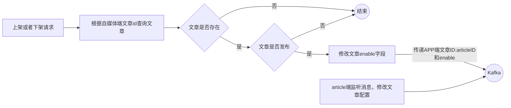

# kafka及异步通知文章上下架

## 自媒体文章上下架需求

自媒体端发布文章之后可以下架文章，点击下架文章之后会调用 APP 端服务下架 APP 端的文章，自媒体端文章显示已下架即可，而 APP 端文章是真的下架。

可以使用 feign 远程调用来解决该需求。但是这种方式过于耦合，可以使用 MQ 消息队列来解耦。这里采用 Kafka 消息队列。

## Docker 部署Kafka

```sql
[root@localhost ~]# systemctl start docker

# 拉取zookeeper镜像 创建容器
[root@localhost ~]# docker pull zookeeper:3.4.14
3.4.14: Pulling from library/zookeeper
Digest: sha256:3882d9493d387ba77b7b69e2a031b9396477ec29483d51ceaed645c1389182e5
Status: Downloaded newer image for zookeeper:3.4.14
docker.io/library/zookeeper:3.4.14
# -d后台运行 --restart=always开机自启动
[root@localhost ~]# docker run -d --name zookeeper --restart=always -p 2181:2181 zookeeper:3.4.14
5264dfbb46466d484e023356928c7ee9bfc8f57ac1aecbb5df86878e877f6b74

# 拉取kafka镜像 创建容器
[root@localhost ~]# docker pull wurstmeister/kafka:2.12-2.3.1
Digest: sha256:0b22bb436ecde11e0db1ce84170b979ce7130e5f1b292b16eace548cd78d7d9e
Status: Downloaded newer image for wurstmeister/kafka:2.12-2.3.1
docker.io/wurstmeister/kafka:2.12-2.3.1
# KAFKA_ADVERTISED_HOST_NAME=192.168.88.129更换为本机地址
# KAFKA_LISTENERS监听的端口号
# --net=host直接使用容器宿主机的网络命名空间，使用宿主机IP和端口。这里约等于 -p 9092:9092
[root@localhost ~]# docker run -d --name kafka \
--env KAFKA_ADVERTISED_HOST_NAME=192.168.88.129 \
--env KAFKA_ZOOKEEPER_CONNECT=192.168.88.129:2181 \
--env KAFKA_ADVERTISED_LISTENERS=PLAINTEXT://192.168.88.129:9092 \
--env KAFKA_LISTENERS=PLAINTEXT://0.0.0.0:9092 \
--env KAFKA_HEAP_OPTS="-Xmx256M -Xms256M" \
--net=host wurstmeister/kafka:2.12-2.3.1
--restart=always
60a6024d0b9b52d33cfc5c9a4e58c6574c5db6318f1a9c7185c85182d659470e
```

## 自媒体文章上下架功能

已发表且已上架的文章可以下架、已发表且已下架的文章可以上架。

```sql
CREATE TABLE `wm_news` (
  `id` int NOT NULL AUTO_INCREMENT COMMENT '主键',
  `user_id` int unsigned DEFAULT NULL COMMENT '自媒体用户ID',
  `title` varchar(36) CHARACTER SET utf8mb4 COLLATE utf8mb4_unicode_ci DEFAULT NULL COMMENT '标题',
  `content` longtext CHARACTER SET utf8mb4 COLLATE utf8mb4_unicode_ci COMMENT '图文内容',
  `type` tinyint unsigned DEFAULT NULL COMMENT '文章布局\r\n            0 无图文章\r\n            1 单图文章\r\n            3 多图文章',
  `channel_id` int unsigned DEFAULT NULL COMMENT '图文频道ID',
  `labels` varchar(20) CHARACTER SET utf8mb4 COLLATE utf8mb4_unicode_ci DEFAULT NULL,
  `created_time` datetime DEFAULT NULL COMMENT '创建时间',
  `submited_time` datetime DEFAULT NULL COMMENT '提交时间',
  `status` tinyint unsigned DEFAULT NULL COMMENT '当前状态\r\n            0 草稿\r\n            1 提交（待审核）\r\n            2 审核失败\r\n            3 人工审核\r\n            4 人工审核通过\r\n            8 审核通过（待发布）\r\n            9 已发布',
  `publish_time` datetime DEFAULT NULL COMMENT '定时发布时间，不定时则为空',
  `reason` varchar(50) CHARACTER SET utf8mb4 COLLATE utf8mb4_unicode_ci DEFAULT NULL COMMENT '拒绝理由',
  `article_id` bigint unsigned DEFAULT NULL COMMENT '发布库文章ID',
  `images` longtext CHARACTER SET utf8mb4 COLLATE utf8mb4_unicode_ci COMMENT '//图片 用逗号分隔',
  `enable` tinyint unsigned DEFAULT '1',
  PRIMARY KEY (`id`) USING BTREE
) ENGINE=InnoDB AUTO_INCREMENT=6273 DEFAULT CHARSET=utf8mb4 COLLATE=utf8mb4_unicode_ci ROW_FORMAT=DYNAMIC COMMENT='自媒体图文内容信息表'
```

```sql
CREATE TABLE `ap_article_config` (
  `id` bigint unsigned NOT NULL AUTO_INCREMENT COMMENT '主键',
  `article_id` bigint unsigned DEFAULT NULL COMMENT '文章ID',
  `is_comment` tinyint unsigned DEFAULT NULL COMMENT '是否可评论',
  `is_forward` tinyint unsigned DEFAULT NULL COMMENT '是否转发',
  `is_down` tinyint unsigned DEFAULT NULL COMMENT '是否下架',
  `is_delete` tinyint unsigned DEFAULT NULL COMMENT '是否已删除',
  PRIMARY KEY (`id`) USING BTREE,
  KEY `idx_article_id` (`article_id`) USING BTREE
) ENGINE=InnoDB AUTO_INCREMENT=1777171261282193412 DEFAULT CHARSET=utf8mb4 COLLATE=utf8mb4_unicode_ci ROW_FORMAT=DYNAMIC COMMENT='APP已发布文章配置表'
```



```xml
<!-- leadnews-common模块引入依赖 -->
<!-- kafkfa -->
<dependency>
    <groupId>org.springframework.kafka</groupId>
    <artifactId>spring-kafka</artifactId>
</dependency>
<dependency>
    <groupId>org.apache.kafka</groupId>
    <artifactId>kafka-clients</artifactId>
</dependency>
```

### 接口定义

|          | **说明**                |
| -------- | ----------------------- |
| 接口路径 | /api/v1/news/down_or_up |
| 请求方式 | POST                    |
| 参数     | WmNewsDto               |
| 响应结果 | ResponseResult          |

```java
package com.linxuan.model.wemedia.dtos;

@Data
public class WmNewsDto {

    private Integer id;

    /**
     * 标题
     */
    private String title;

    /**
     * 频道id
     */
    private Integer channelId;

    /**
     * 标签
     */
    private String labels;

    /**
     * 发布时间
     */
    private Date publishTime;

    /**
     * 文章内容
     */
    private String content;

    /**
     * 文章封面类型  0无图 1单图 3多图 -1自动
     */
    private Short type;

    /**
     * 提交时间
     */
    private Date submitedTime;

    /**
     * 状态 提交为1  草稿为0
     */
    private Short status;

    /**
     * 封面图片列表 多张图以逗号隔开
     */
    private List<String> images;

    /**
     * WmNewsDto中新增属性enable 文章上下架  0下架  1上架
     */
    private Short enable;
}
```

```json
// 四种可能返回的结果
{
    "code": 501,
    "errorMessage": "文章ID不可缺少"
}
{
    "code": 1002,
    "errorMessage": "文章不存在"
}
{
    "code": 200,
    "errorMessage": "操作成功"
}
{
    "code": 501,
    "errorMessage": "当前文章不是发布状态 不能上下架"
}
```

### 自媒体端功能实现

```yml
spring:
  # leadnews-wemedia微服务集成kafka，添加nacos配置
  kafka:
    bootstrap-servers: 192.168.88.129:9092
    producer:
      retries: 10
      key-serializer: org.apache.kafka.common.serialization.StringSerializer
      value-serializer: org.apache.kafka.common.serialization.StringSerializer
```

```java
package com.linxuan.common.constants;

public class WmNewsMessageConstants {
    // 传递的参数
    // APP端文章ID
    public static final String ARTICLE_ID = "articleId";
    // 需要修改为的上下架状态
    public static final String ENABLE = "enable";

    // 文章上下架功能传递kafka消息的主题
    public static final String WM_NEWS_UP_OR_DOWN_TOPIC = "wm.news.up.or.down.topic";
}
```

```java
package com.linxuan.wemedia.controller.v1;

@Slf4j
@RestController
@RequestMapping("/api/v1/news/")
public class WmNewsController {

    @Autowired
    private WmNewsService wmNewsService;

    @Autowired
    private WmNewsAutoScanService wmNewsAutoScanService;
    
    /**
     * 文章上下架请求
     *
     * @param dto 主要传递文章ID及上下架值　enable 0是下架 1是上架
     * @return 返回上下架结果
     */
    @PostMapping("/down_or_up")
    public ResponseResult downOrUp(@RequestBody WmNewsDto dto) {
        return wmNewsService.downOrUp(dto);
    }
}
```

```java
package com.linxuan.wemedia.service;

public interface WmNewsService extends IService<WmNews> {

    /**
     * 文章上下架请求
     *
     * @param dto 主要传递文章ID及上下架值　enable 0是下架 1是上架
     * @return 返回上下架结果
     */
    ResponseResult downOrUp(WmNewsDto dto);
}
```

```java
package com.linxuan.wemedia.service.impl;

@Slf4j
@Service
@Transactional
public class WmNewsServiceImpl extends ServiceImpl<WmNewsMapper, WmNews> implements WmNewsService {

    @Autowired
    private WmMaterialMapper wmMaterialMapper;

    @Autowired
    private WmNewsMaterialMapper wmNewsMaterialMapper;

    @Autowired
    private WmNewsAutoScanService wmNewsAutoScanService;

    @Autowired
    private WmNewsTaskService wmNewsTaskService;

    @Autowired
    private KafkaTemplate kafkaTemplate;

    /**
     * 文章上下架请求
     *
     * @param dto 主要传递文章ID及上下架值　enable 0是下架 1是上架
     * @return 返回上下架结果
     */
    @Override
    public ResponseResult downOrUp(WmNewsDto dto) {
        // 校验参数
        if (dto == null
                || dto.getId() == null
                || dto.getEnable() == null
                || dto.getEnable() <= -1
                || dto.getEnable() >= 2) {
            return ResponseResult.errorResult(AppHttpCodeEnum.PARAM_INVALID, "参数有问题");
        }

        // 查询文章
        WmNews wmNews = getById(dto.getId());
        if (wmNews == null) {
            return ResponseResult.errorResult(AppHttpCodeEnum.DATA_NOT_EXIST, "文章不存在");
        }

        // 判断文章是否发布
        if (!wmNews.getStatus().equals(WmNews.Status.PUBLISHED.getCode())) {
            return ResponseResult.errorResult(AppHttpCodeEnum.PARAM_INVALID,
                                              "当前文章不是发布状态 不能够上下架");
        }

        // 修改文章enable字段
        update(new LambdaUpdateWrapper<WmNews>()
                .eq(WmNews::getId, wmNews.getId())
                .set(WmNews::getEnable, dto.getEnable()));

        // 传递Kafka消息
        if (wmNews.getArticleId() != null) {
            Map<String, Object> map = new HashMap<>();
            map.put(WmNewsMessageConstants.ARTICLE_ID, wmNews.getArticleId());
            map.put(WmNewsMessageConstants.ENABLE, dto.getEnable());
            kafkaTemplate.send(WmNewsMessageConstants.WM_NEWS_UP_OR_DOWN_TOPIC,
                               JSON.toJSONString(map));
        }
        
        return ResponseResult.okResult(AppHttpCodeEnum.SUCCESS);
    }
}
```

### 消息通知article端

article 端的 nacos 配置中心配置 kafka 的消费者

```yaml
spring:
  # article 端的 nacos 配置中心配置 kafka 的消费者
  kafka:
    bootstrap-servers: 192.168.88.129:9092
    consumer:
      group-id: ${spring.application.name}
      key-deserializer: org.apache.kafka.common.serialization.StringDeserializer
      value-deserializer: org.apache.kafka.common.serialization.StringDeserializer
```

修改 ap_article_config 表的数据

```java
package com.linxuan.article.service;

public interface ApArticleConfigService extends IService<ApArticleConfig> {

    /**
     * 修改文章配置
     *
     * @param map
     */
    public void updateByMap(Map map);
}
```

```java
package com.linxuan.article.service.impl;

@Slf4j
@Service
@Transactional
public class ApArticleConfigServiceImpl extends ServiceImpl<ApArticleConfigMapper, ApArticleConfig> implements ApArticleConfigService {

    /**
     * 修改文章配置
     *
     * @param map
     */
    @Override
    public void updateByMap(Map map) {
        Object enable = map.get(WmNewsMessageConstants.ENABLE);
        if (enable != null) {
            // 修改APP端文章配置是否下架 ap_article_config.isDown代表是否下架
            // true为下架 false为上架 对应自媒体端的enable 1是上架 0是下架
            boolean isDown = true;
            // 如果自媒体端传过来enable为1代表上架 将isDown属性设置为false
            if (enable.equals(1)) {
                isDown = false;
            }
            // 修改
            update(new LambdaUpdateWrapper<ApArticleConfig>()
                    .eq(ApArticleConfig::getId, map.get(WmNewsMessageConstants.ARTICLE_ID))
                    .set(ApArticleConfig::getIsDown, isDown));
        }
    }
}
```

在 article 端编写监听，接收数据

```java
package com.linxuan.article.listener;

@Slf4j
@Component
public class ArtilceIsDownListener {

    @Autowired
    private ApArticleConfigService apArticleConfigService;

    @KafkaListener(topics = WmNewsMessageConstants.WM_NEWS_UP_OR_DOWN_TOPIC)
    public void onMessage(String message) {
        if (StringUtils.isNotBlank(message)) {
            Map map = JSON.parseObject(message, Map.class);
            apArticleConfigService.updateByMap(map);
            log.info("article端文章配置修改，articleId={}", map.get("articleId"));
        }
    }
}
```

启动项目：ArticleApplication、ScheduleApplication、WemediaApplication、WemediaGatewayApplication 以及前端自媒体项目。测试上下架功能，正常。

